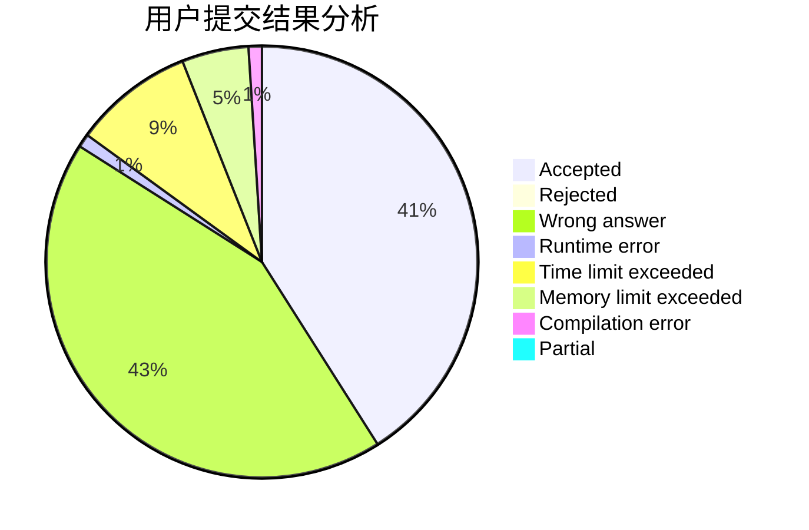
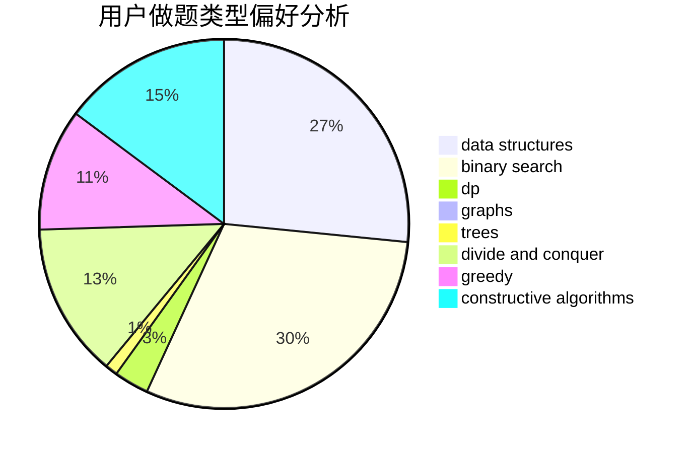

# Taday

<!-- tabs:start -->

#### **用户提交结果分析**

#### **用户做题类型偏好分析**

#### **用户错题知识点分析**

<!-- tabs:end -->
# 推荐题目
[914C](https://codeforces.com/contest/914/problem/C)		brute force,
                        combinatorics,
                        dp		  
[445A](https://codeforces.com/contest/445/problem/A)		dfs and similar,
                        implementation		  
[477D](https://codeforces.com/contest/477/problem/D)		dp,
                        strings		  
[1270H](https://codeforces.com/contest/1270/problem/H)		data structures		  
[1373F](https://codeforces.com/contest/1373/problem/F)		binary search,
                        constructive algorithms,
                        data structures,
                        greedy		  
[1116C1](https://codeforces.com/contest/1116C/problem/1)		nan		  
[405C](https://codeforces.com/contest/405/problem/C)		implementation,
                        math		  
[1204D1](https://codeforces.com/contest/1204D/problem/1)		brute force,
                        greedy,
                        strings		  
[1004C](https://codeforces.com/contest/1004/problem/C)		constructive algorithms,
                        implementation		  
[305C](https://codeforces.com/contest/305/problem/C)		greedy,
                        implementation		  
