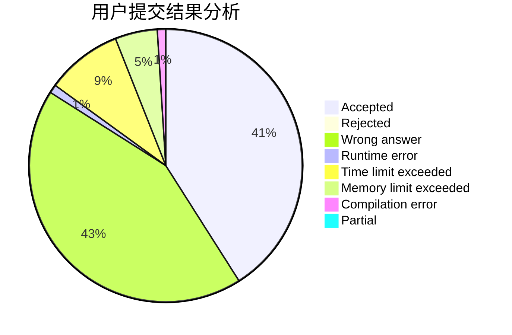
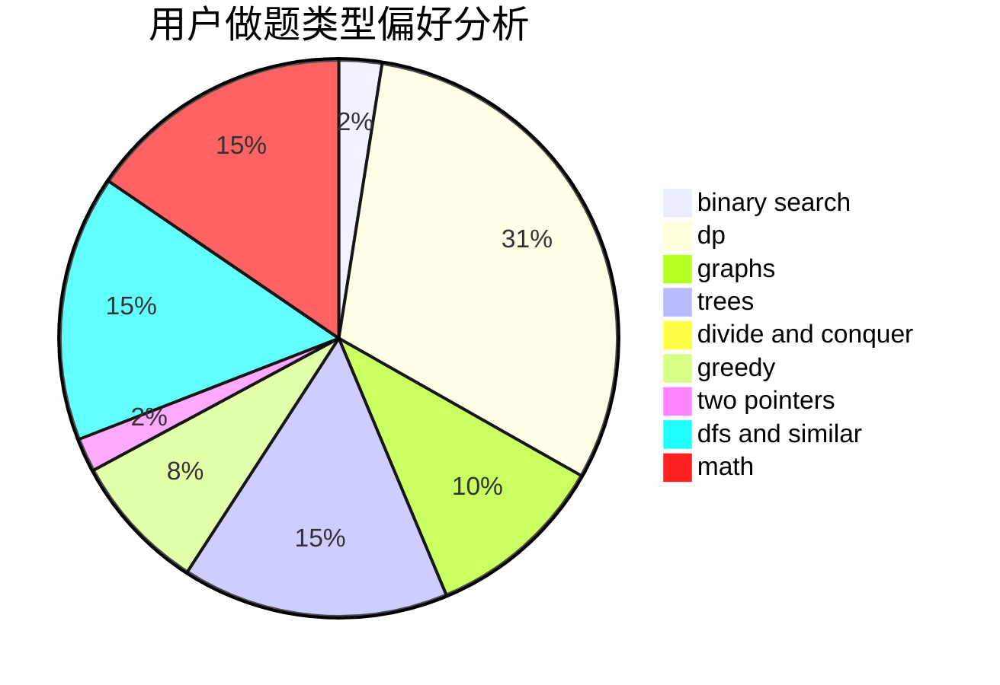

# Taday

<!-- tabs:start -->

#### **用户提交结果分析**

#### **用户做题类型偏好分析**

<!-- tabs:end -->
# 推荐题目
[933B](https://codeforces.com/contest/933/problem/B)
[464E](https://codeforces.com/contest/464/problem/E)
[497D](https://codeforces.com/contest/497/problem/D)
[1280A](https://codeforces.com/contest/1280/problem/A)
[1382B](https://codeforces.com/contest/1382/problem/B)
[1117G](https://codeforces.com/contest/1117/problem/G)
[434C](https://codeforces.com/contest/434/problem/C)
[12092](https://codeforces.com/contest/1209/problem/2)
[1004F](https://codeforces.com/contest/1004/problem/F)
[325E](https://codeforces.com/contest/325/problem/E)
