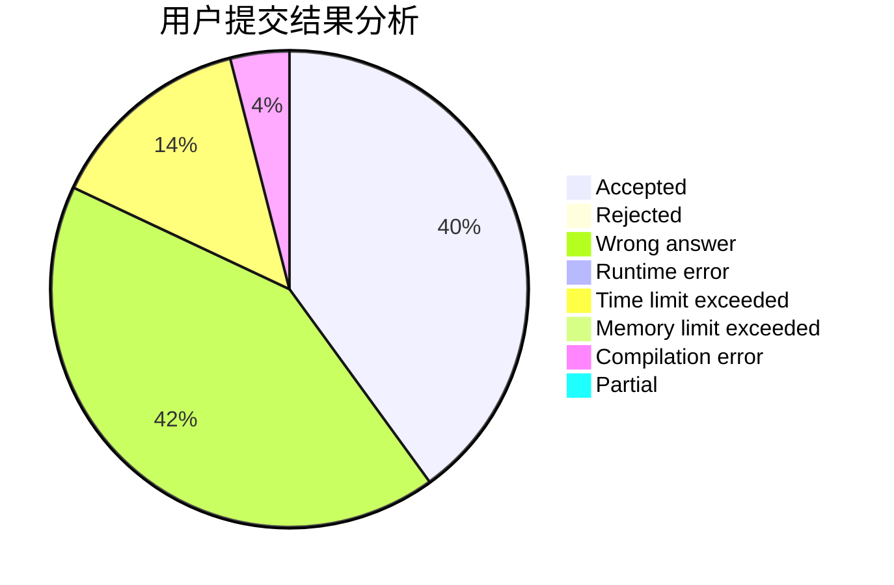
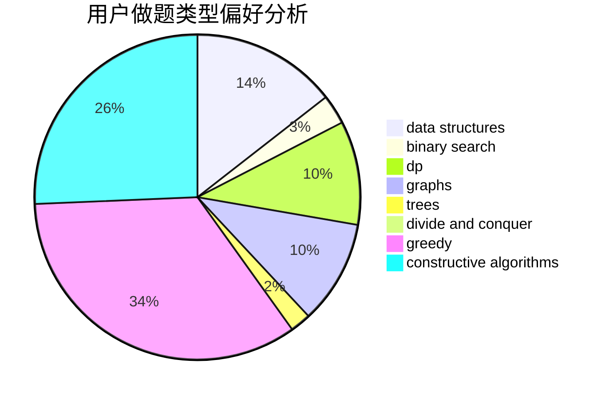
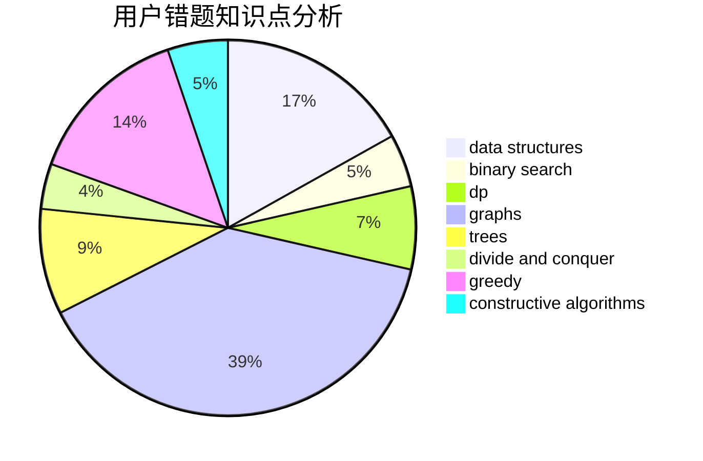

# Takanashi_RikkaQAQ

<!-- tabs:start -->

#### **用户提交结果分析**

#### **用户做题类型偏好分析**

#### **用户错题知识点分析**

<!-- tabs:end -->
# 推荐题目
[1148B](https://codeforces.com/contest/1148/problem/B)		binary search,
                        brute force,
                        two pointers		  
[152E](https://codeforces.com/contest/152/problem/E)		bitmasks,
                        dp,
                        graphs,
                        trees		  
[220C](https://codeforces.com/contest/220/problem/C)		data structures		  
[300E](https://codeforces.com/contest/300/problem/E)		binary search,
                        math,
                        number theory		  
[1168C](https://codeforces.com/contest/1168/problem/C)		bitmasks,
                        dp		  
[14D](https://codeforces.com/contest/14/problem/D)		dfs and similar,
                        dp,
                        graphs,
                        shortest paths,
                        trees,
                        two pointers		  
[1081F](https://codeforces.com/contest/1081/problem/F)		constructive algorithms,
                        implementation,
                        interactive		  
[755C](https://codeforces.com/contest/755/problem/C)		dfs and similar,
                        dsu,
                        graphs,
                        interactive,
                        trees		  
[637B](https://codeforces.com/contest/637/problem/B)		*special problem,
                        binary search,
                        constructive algorithms,
                        data structures,
                        sortings		  
[171H](https://codeforces.com/contest/171/problem/H)		*special problem,
                        implementation		  
