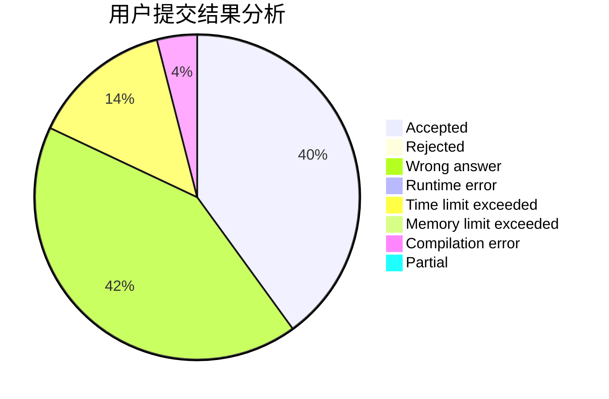
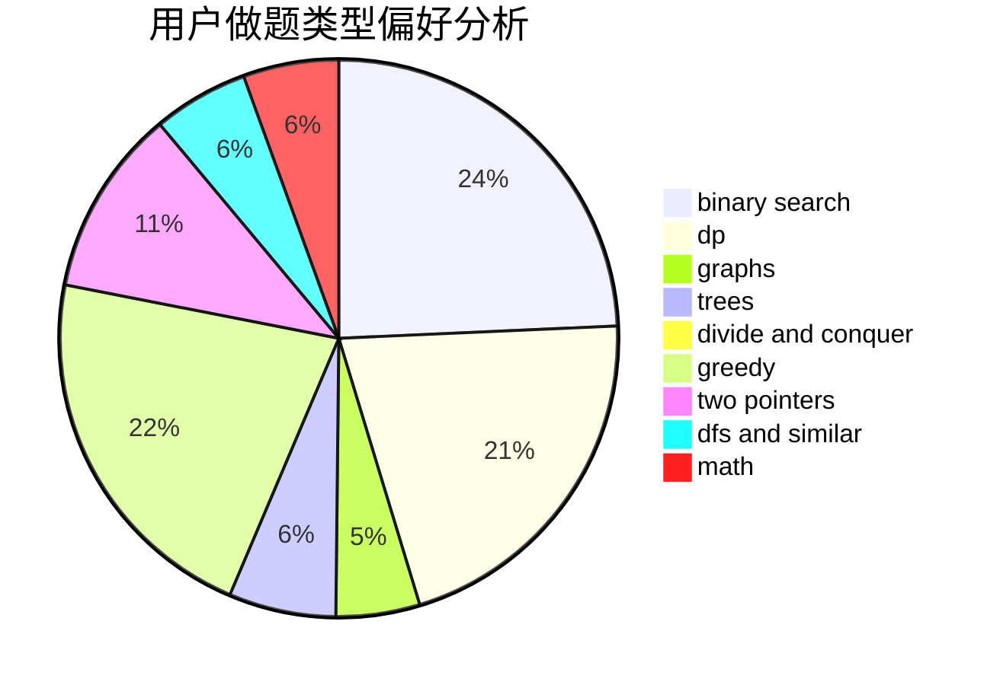

# Takanashi_RikkaQAQ

<!-- tabs:start -->

#### **用户提交结果分析**

#### **用户做题类型偏好分析**

<!-- tabs:end -->
# 推荐题目
[1148B](https://codeforces.com/contest/1148/problem/B)
[152E](https://codeforces.com/contest/152/problem/E)
[220C](https://codeforces.com/contest/220/problem/C)
[300E](https://codeforces.com/contest/300/problem/E)
[1168C](https://codeforces.com/contest/1168/problem/C)
[14D](https://codeforces.com/contest/14/problem/D)
[1081F](https://codeforces.com/contest/1081/problem/F)
[755C](https://codeforces.com/contest/755/problem/C)
[637B](https://codeforces.com/contest/637/problem/B)
[171H](https://codeforces.com/contest/171/problem/H)
