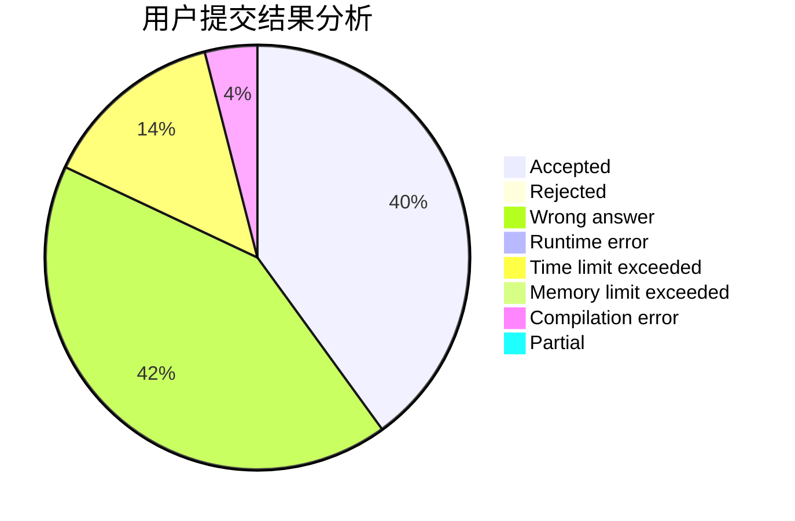
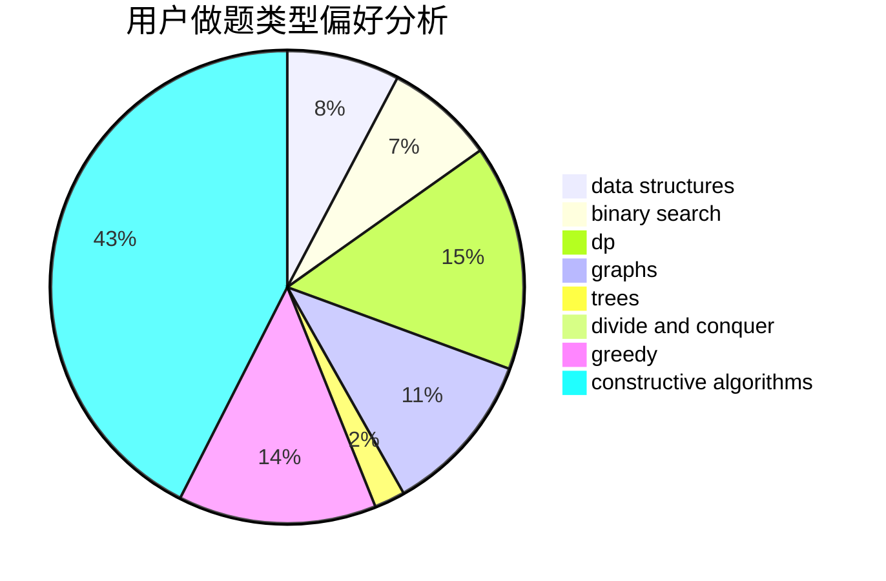
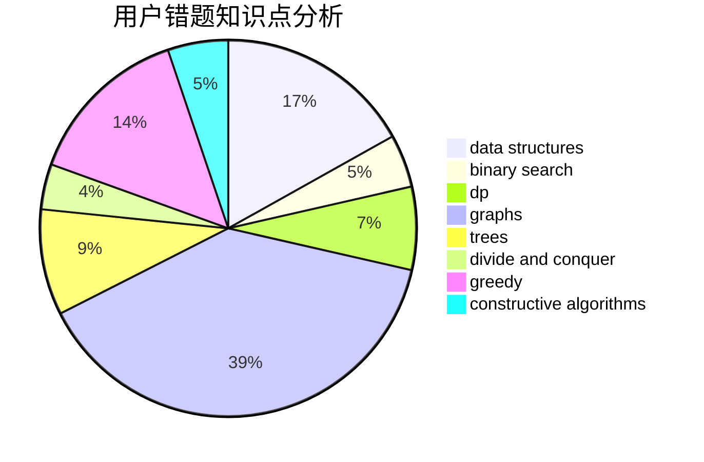

# Takanashi_RikkaQAQ

<!-- tabs:start -->

#### **用户提交结果分析**

#### **用户做题类型偏好分析**

#### **用户错题知识点分析**

<!-- tabs:end -->
# 推荐题目
[1146B](https://codeforces.com/contest/1146/problem/B)		implementation,
                        strings		  
[1505D](https://codeforces.com/contest/1505/problem/D)		number theory		  
[199D](https://codeforces.com/contest/199/problem/D)		dsu,graphs,sortings,trees		  
[286D](https://codeforces.com/contest/286/problem/D)		data structures,
                        sortings		  
[1165F2](https://codeforces.com/contest/1165F/problem/2)		binary search,
                        greedy,
                        implementation		  
[1491G](https://codeforces.com/contest/1491/problem/G)		constructive algorithms,
                        graphs,
                        math		  
[1081C](https://codeforces.com/contest/1081/problem/C)		combinatorics,
                        dp,
                        math		  
[734D](https://codeforces.com/contest/734/problem/D)		implementation		  
[618A](https://codeforces.com/contest/618/problem/A)		implementation		  
[1513A](https://codeforces.com/contest/1513/problem/A)		constructive algorithms,
                        implementation		  
