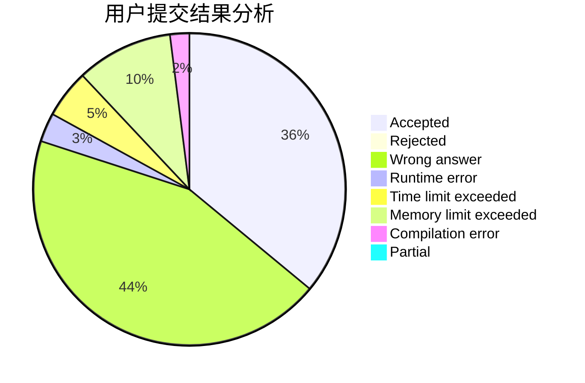
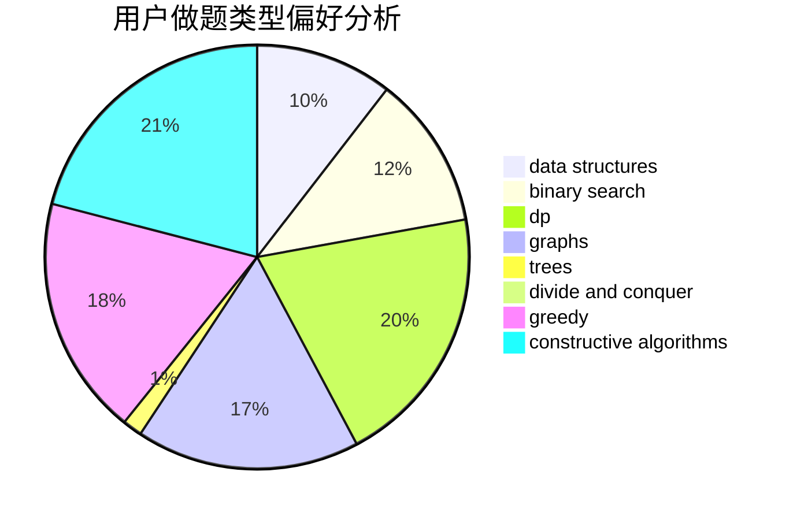
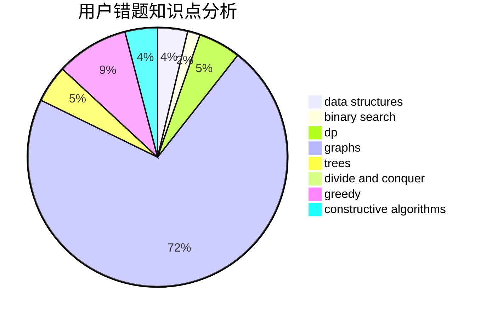

# Tamaki_Iroha

<!-- tabs:start -->

#### **用户提交结果分析**

#### **用户做题类型偏好分析**

#### **用户错题知识点分析**

<!-- tabs:end -->
# 推荐题目
[1215B](https://codeforces.com/contest/1215/problem/B)		combinatorics,
                        dp,
                        implementation		  
[901C](https://codeforces.com/contest/901/problem/C)		binary search,
                        data structures,
                        dfs and similar,
                        dsu,
                        graphs,
                        two pointers		  
[117C](https://codeforces.com/contest/117/problem/C)		dfs and similar,
                        graphs		  
[218C](https://codeforces.com/contest/218/problem/C)		dsu,graphs,sortings,trees		  
[1389E](https://codeforces.com/contest/1389/problem/E)		math,
                        number theory		  
[551A](https://codeforces.com/contest/551/problem/A)		brute force,
                        implementation,
                        sortings		  
[876D](https://codeforces.com/contest/876/problem/D)		dsu,graphs,sortings,trees		  
[146B](https://codeforces.com/contest/146/problem/B)		brute force,
                        implementation		  
[607D](https://codeforces.com/contest/607/problem/D)		data structures,
                        trees		  
[767C](https://codeforces.com/contest/767/problem/C)		dfs and similar,
                        graphs,
                        greedy,
                        trees		  
