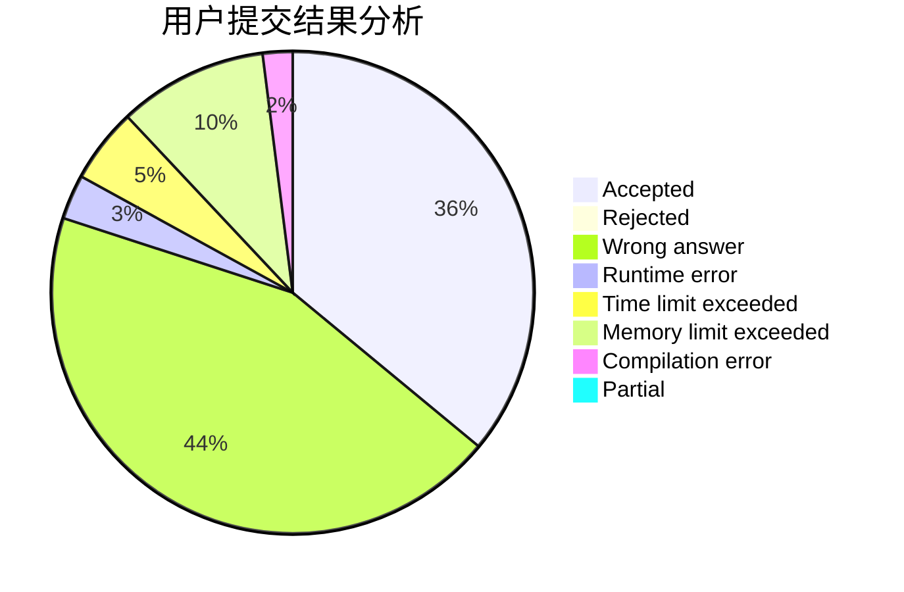
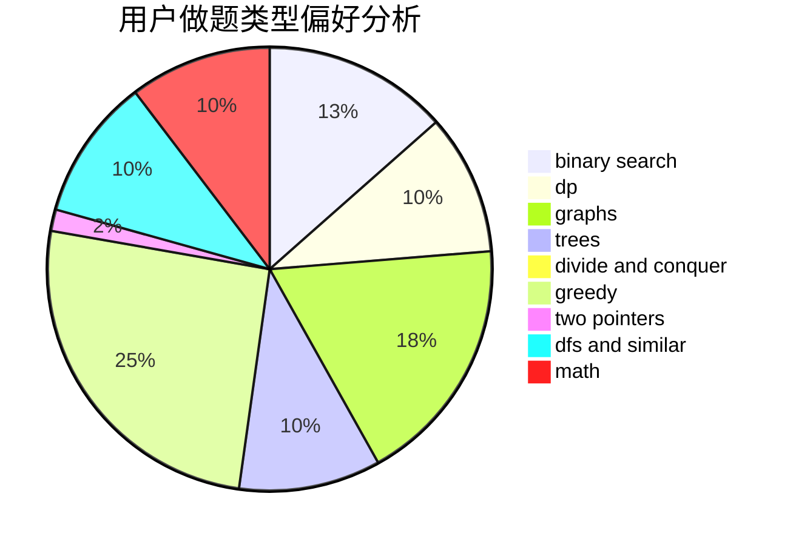

# Tamaki_Iroha

<!-- tabs:start -->

#### **用户提交结果分析**

#### **用户做题类型偏好分析**

<!-- tabs:end -->
# 推荐题目
[1215B](https://codeforces.com/contest/1215/problem/B)
[901C](https://codeforces.com/contest/901/problem/C)
[117C](https://codeforces.com/contest/117/problem/C)
[218C](https://codeforces.com/contest/218/problem/C)
[1389E](https://codeforces.com/contest/1389/problem/E)
[551A](https://codeforces.com/contest/551/problem/A)
[876D](https://codeforces.com/contest/876/problem/D)
[146B](https://codeforces.com/contest/146/problem/B)
[607D](https://codeforces.com/contest/607/problem/D)
[767C](https://codeforces.com/contest/767/problem/C)
