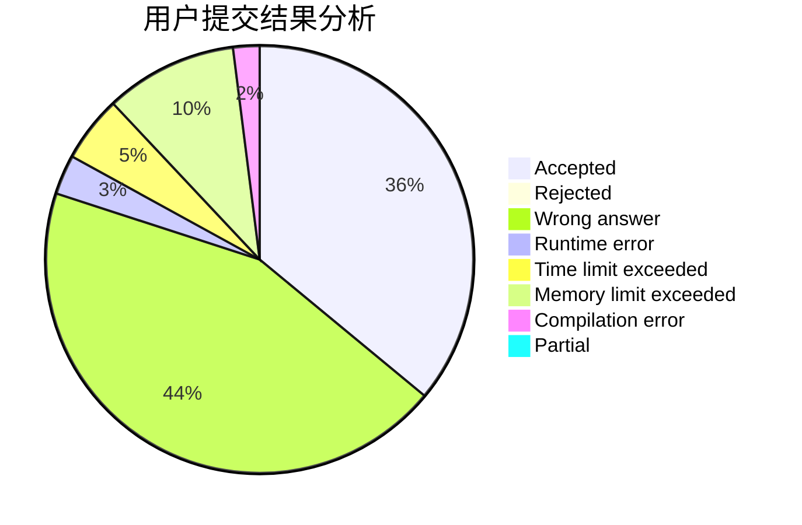
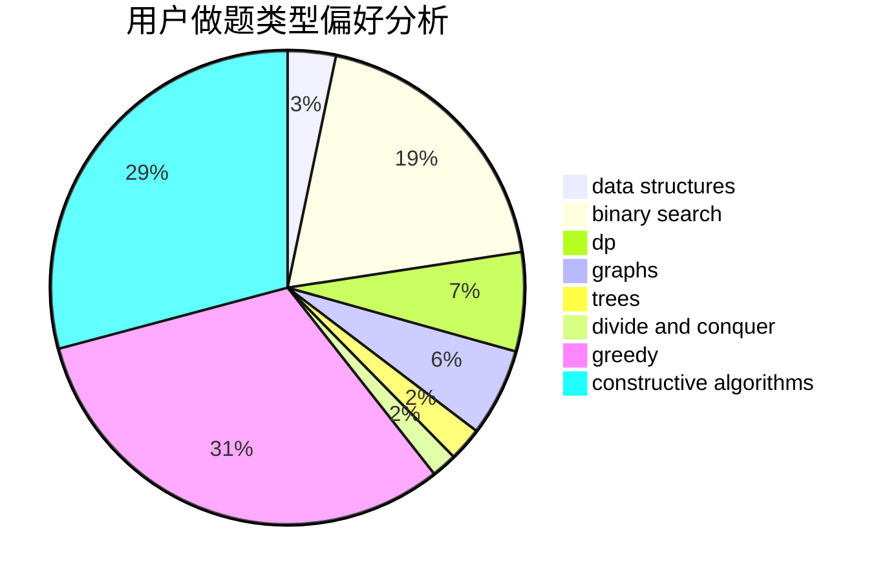
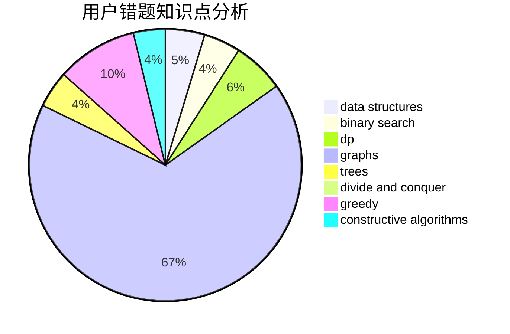

# Tamaki_Iroha

<!-- tabs:start -->

#### **用户提交结果分析**

#### **用户做题类型偏好分析**

#### **用户错题知识点分析**

<!-- tabs:end -->
# 推荐题目
[1209E2](https://codeforces.com/contest/1209E/problem/2)		bitmasks,
                        dp,
                        greedy,
                        sortings		  
[883I](https://codeforces.com/contest/883/problem/I)		binary search,
                        dp		  
[1176E](https://codeforces.com/contest/1176/problem/E)		dfs and similar,
                        dsu,
                        graphs,
                        shortest paths,
                        trees		  
[195C](https://codeforces.com/contest/195/problem/C)		expression parsing,
                        implementation		  
[1380B](https://codeforces.com/contest/1380/problem/B)		greedy		  
[526G](https://codeforces.com/contest/526/problem/G)		greedy,
                        trees		  
[859A](https://codeforces.com/contest/859/problem/A)		greedy,
                        implementation		  
[1462E1](https://codeforces.com/contest/1462E/problem/1)		binary search,
                        combinatorics,
                        math,
                        sortings,
                        two pointers		  
[587C](https://codeforces.com/contest/587/problem/C)		data structures,
                        trees		  
[747F](https://codeforces.com/contest/747/problem/F)		brute force,
                        combinatorics,
                        dp,
                        math		  
