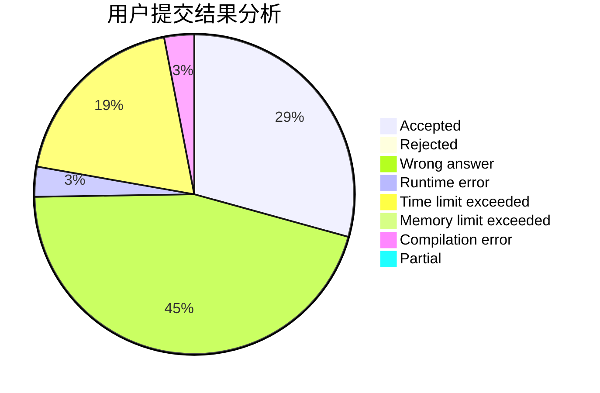
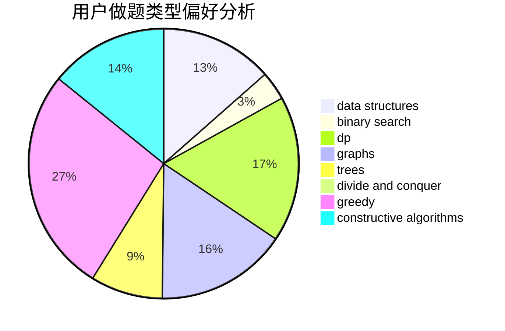
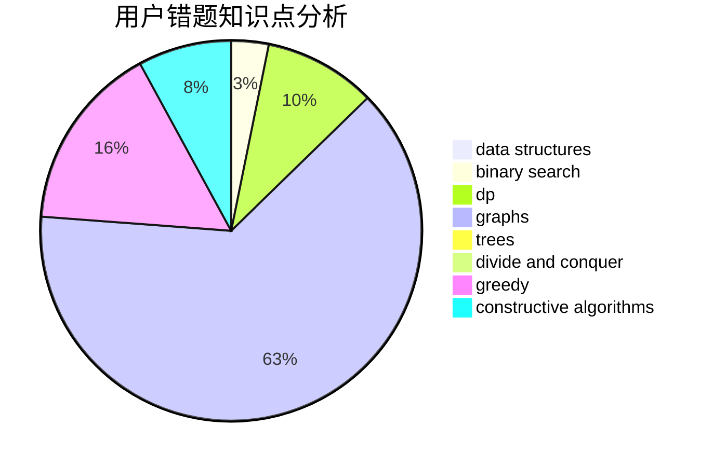

# TanakaAsuka

<!-- tabs:start -->

#### **用户提交结果分析**

#### **用户做题类型偏好分析**

#### **用户错题知识点分析**

<!-- tabs:end -->
# 推荐题目
[1129D](https://codeforces.com/contest/1129/problem/D)		data structures,
                        dp		  
[1243A](https://codeforces.com/contest/1243/problem/A)		implementation		  
[911A](https://codeforces.com/contest/911/problem/A)		implementation		  
[1401E](https://codeforces.com/contest/1401/problem/E)		data structures,
                        geometry,
                        implementation,
                        sortings		  
[1384E](https://codeforces.com/contest/1384/problem/E)		dsu,graphs,sortings,trees		  
[1302F](https://codeforces.com/contest/1302/problem/F)		bitmasks,
                        brute force,
                        expression parsing		  
[815B](https://codeforces.com/contest/815/problem/B)		brute force,
                        combinatorics,
                        constructive algorithms,
                        math		  
[521A](https://codeforces.com/contest/521/problem/A)		dsu,graphs,sortings,trees		  
[7A](https://codeforces.com/contest/7/problem/A)		brute force,
                        constructive algorithms		  
[884A](https://codeforces.com/contest/884/problem/A)		implementation		  
