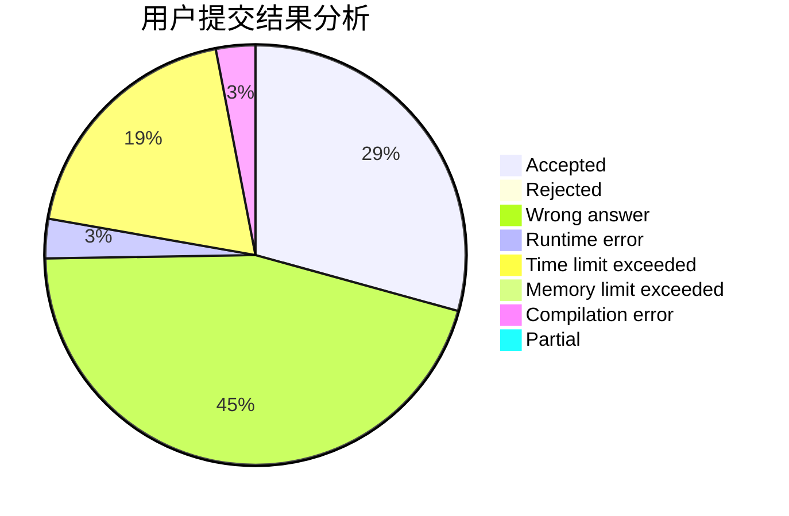
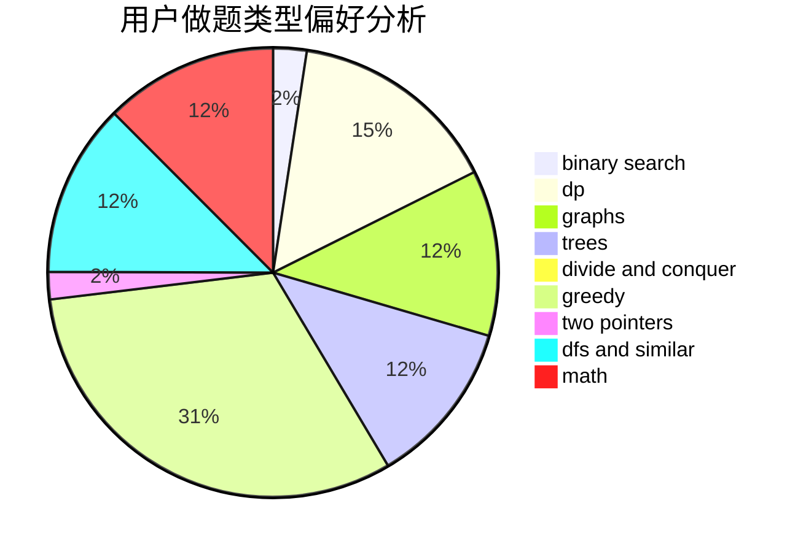

# TanakaAsuka

<!-- tabs:start -->

#### **用户提交结果分析**

#### **用户做题类型偏好分析**

<!-- tabs:end -->
# 推荐题目
[1129D](https://codeforces.com/contest/1129/problem/D)
[1243A](https://codeforces.com/contest/1243/problem/A)
[911A](https://codeforces.com/contest/911/problem/A)
[1401E](https://codeforces.com/contest/1401/problem/E)
[1384E](https://codeforces.com/contest/1384/problem/E)
[1302F](https://codeforces.com/contest/1302/problem/F)
[815B](https://codeforces.com/contest/815/problem/B)
[521A](https://codeforces.com/contest/521/problem/A)
[7A](https://codeforces.com/contest/7/problem/A)
[884A](https://codeforces.com/contest/884/problem/A)
