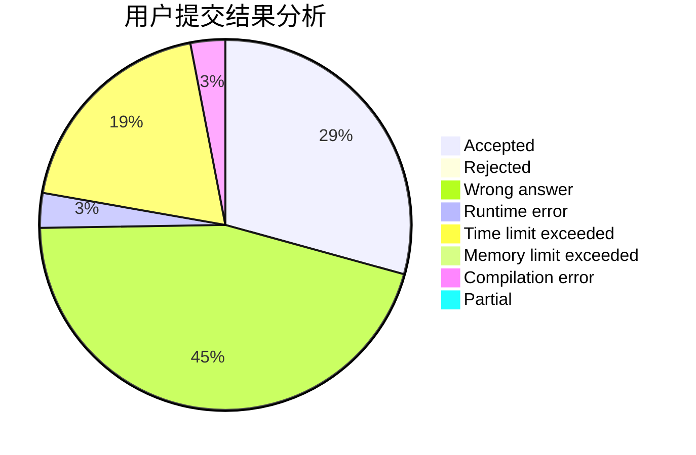
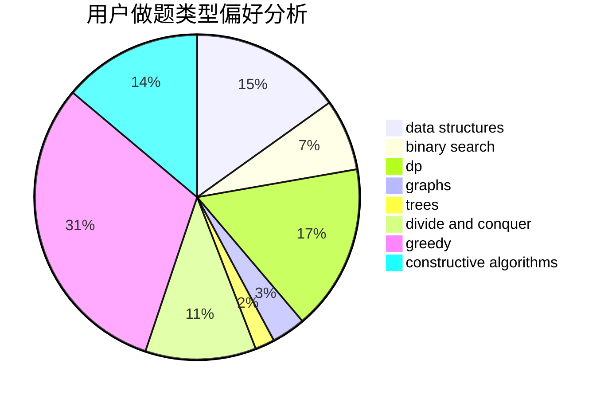
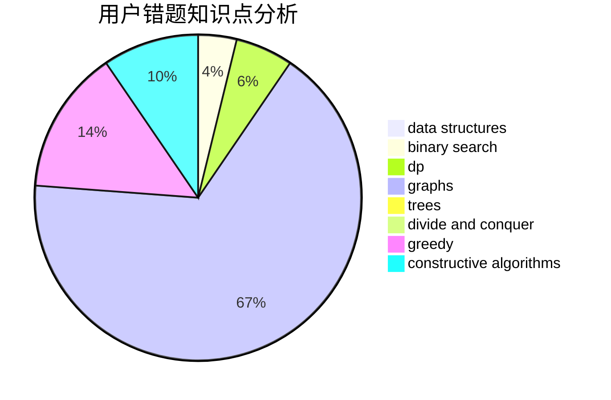

# TanakaAsuka

<!-- tabs:start -->

#### **用户提交结果分析**

#### **用户做题类型偏好分析**

#### **用户错题知识点分析**

<!-- tabs:end -->
# 推荐题目
[1119H](https://codeforces.com/contest/1119/problem/H)		fft,
                        math		  
[1238B](https://codeforces.com/contest/1238/problem/B)		greedy,
                        sortings		  
[893A](https://codeforces.com/contest/893/problem/A)		implementation		  
[1393E2](https://codeforces.com/contest/1393E/problem/2)		dp,
                        hashing,
                        implementation,
                        string suffix structures,
                        strings,
                        two pointers		  
[1375F](https://codeforces.com/contest/1375/problem/F)		constructive algorithms,
                        games,
                        interactive,
                        math		  
[1295D](https://codeforces.com/contest/1295/problem/D)		math,
                        number theory		  
[800A](https://codeforces.com/contest/800/problem/A)		dsu,graphs,sortings,trees		  
[500A](https://codeforces.com/contest/500/problem/A)		dfs and similar,
                        graphs,
                        implementation		  
[781C](https://codeforces.com/contest/781/problem/C)		dsu,graphs,sortings,trees		  
[864D](https://codeforces.com/contest/864/problem/D)		greedy,
                        implementation,
                        math		  
