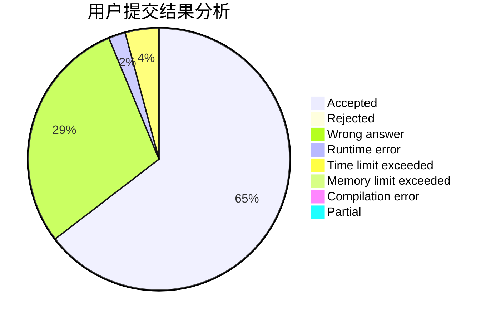
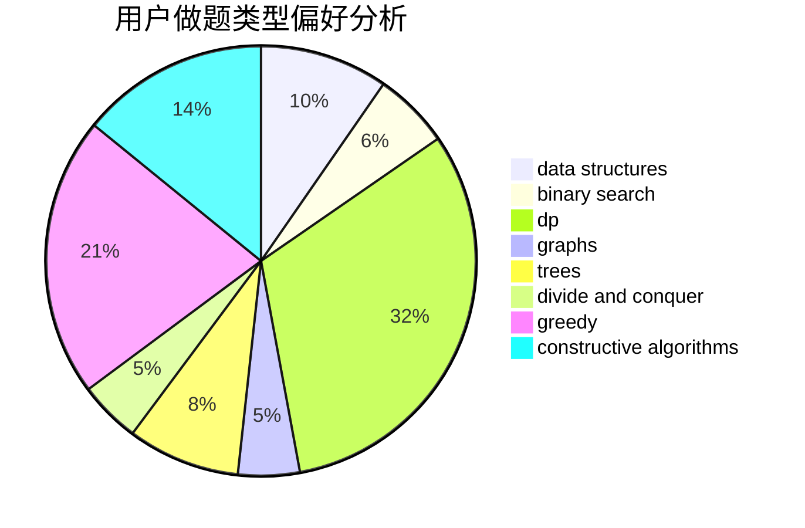

# Acfboy

<!-- tabs:start -->

#### **用户提交结果分析**

#### **用户做题类型偏好分析**

#### **用户错题知识点分析**

<!-- tabs:end -->
# 推荐题目
[1489A](https://codeforces.com/contest/1489/problem/A)		dsu,graphs,sortings,trees		  
[1783](https://codeforces.com/contest/178/problem/3)		dsu,graphs,sortings,trees		  
[185A](https://codeforces.com/contest/185/problem/A)		math		  
[12642](https://codeforces.com/contest/1264/problem/2)		dsu,graphs,sortings,trees		  
[1300C](https://codeforces.com/contest/1300/problem/C)		dsu,graphs,sortings,trees		  
[160B](https://codeforces.com/contest/160/problem/B)		greedy,
                        sortings		  
[18C](https://codeforces.com/contest/18/problem/C)		data structures,
                        implementation		  
[186C](https://codeforces.com/contest/186/problem/C)		dsu,graphs,sortings,trees		  
[182D](https://codeforces.com/contest/182/problem/D)		brute force,
                        hashing,
                        implementation,
                        math,
                        strings		  
[183D](https://codeforces.com/contest/183/problem/D)		dp,
                        greedy,
                        probabilities		  
