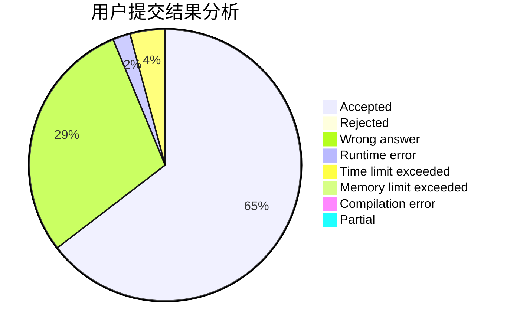
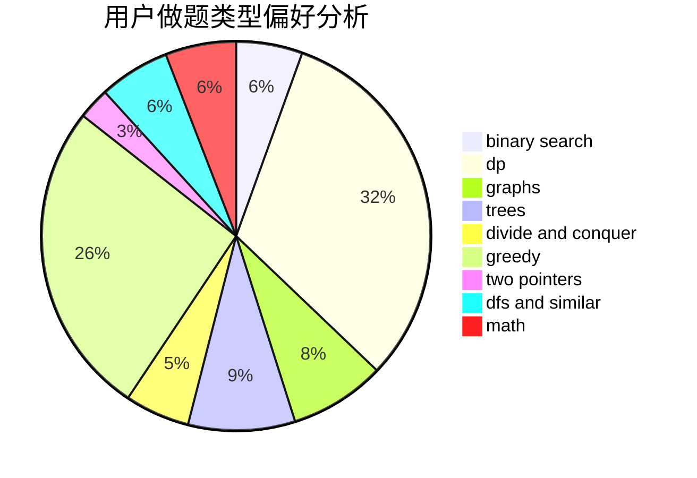

# Acfboy

<!-- tabs:start -->

#### **用户提交结果分析**

#### **用户做题类型偏好分析**

<!-- tabs:end -->
# 推荐题目
[1489A](https://codeforces.com/contest/1489/problem/A)
[1783](https://codeforces.com/contest/178/problem/3)
[185A](https://codeforces.com/contest/185/problem/A)
[12642](https://codeforces.com/contest/1264/problem/2)
[1300C](https://codeforces.com/contest/1300/problem/C)
[160B](https://codeforces.com/contest/160/problem/B)
[18C](https://codeforces.com/contest/18/problem/C)
[186C](https://codeforces.com/contest/186/problem/C)
[182D](https://codeforces.com/contest/182/problem/D)
[183D](https://codeforces.com/contest/183/problem/D)
