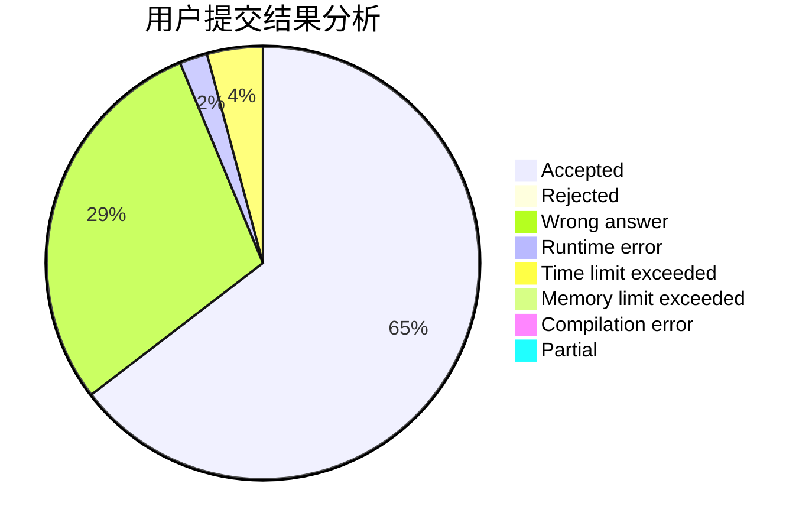
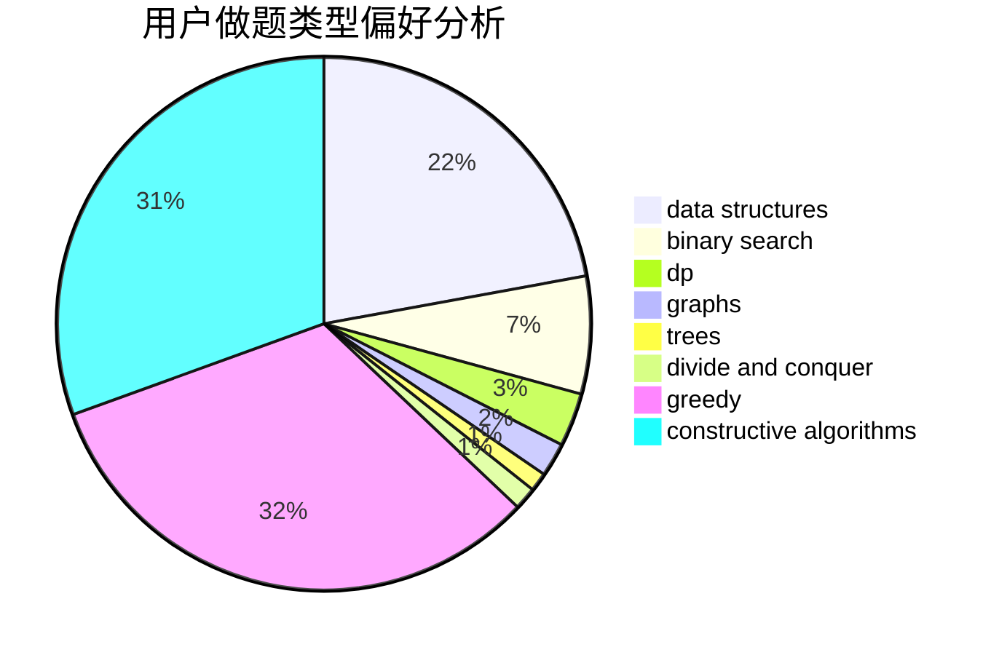

# Acfboy

<!-- tabs:start -->

#### **用户提交结果分析**

#### **用户做题类型偏好分析**

#### **用户错题知识点分析**

<!-- tabs:end -->
# 推荐题目
[1480D2](https://codeforces.com/contest/1480D/problem/2)		dsu,graphs,sortings,trees		  
[157D](https://codeforces.com/contest/157/problem/D)		dsu,graphs,sortings,trees		  
[160B](https://codeforces.com/contest/160/problem/B)		greedy,
                        sortings		  
[1256F](https://codeforces.com/contest/1256/problem/F)		constructive algorithms,
                        sortings,
                        strings		  
[1294A](https://codeforces.com/contest/1294/problem/A)		math		  
[1509D](https://codeforces.com/contest/1509/problem/D)		dsu,graphs,sortings,trees		  
[165A](https://codeforces.com/contest/165/problem/A)		implementation		  
[160D](https://codeforces.com/contest/160/problem/D)		dfs and similar,
                        dsu,
                        graphs,
                        sortings		  
[15C](https://codeforces.com/contest/15/problem/C)		games		  
[160A](https://codeforces.com/contest/160/problem/A)		greedy,
                        sortings		  
