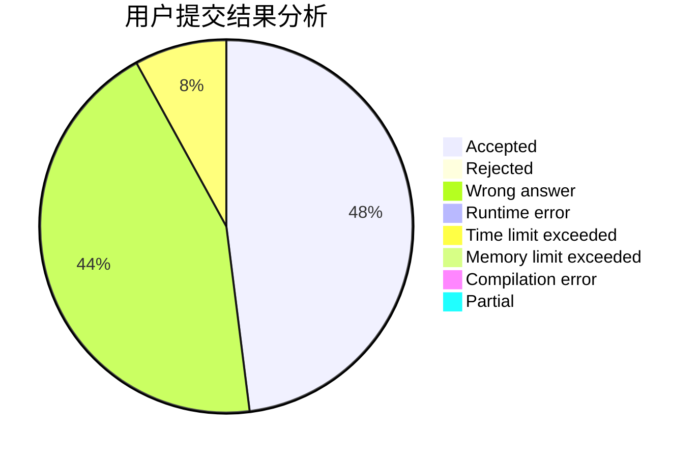
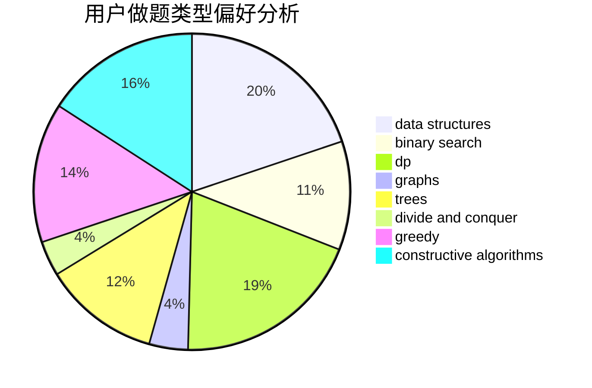
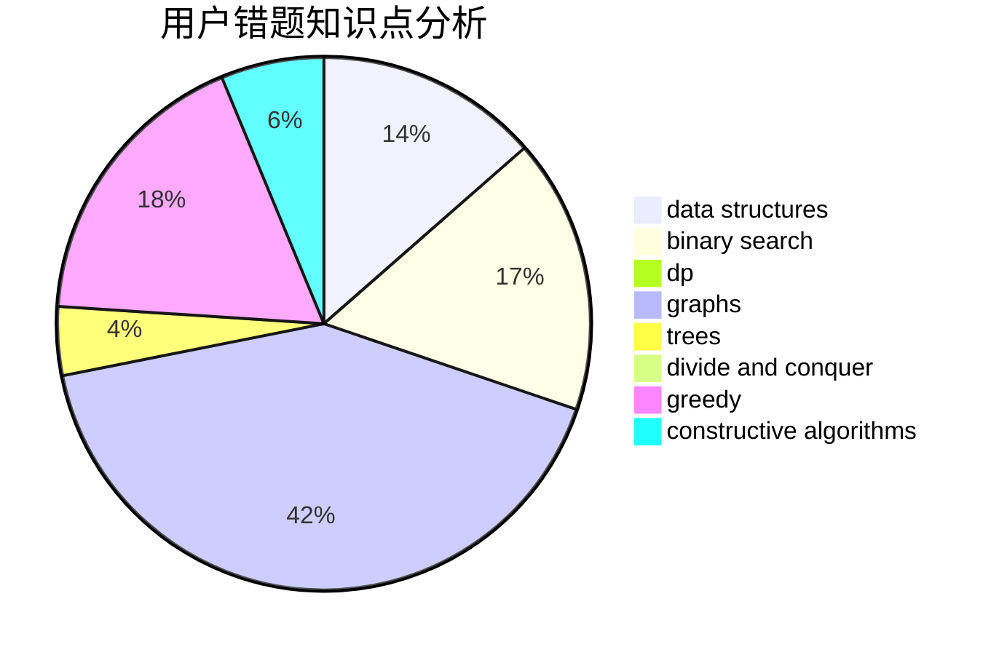

# Tangent617

<!-- tabs:start -->

#### **用户提交结果分析**

#### **用户做题类型偏好分析**

#### **用户错题知识点分析**

<!-- tabs:end -->
# 推荐题目
[1276F](https://codeforces.com/contest/1276/problem/F)		string suffix structures		  
[940A](https://codeforces.com/contest/940/problem/A)		brute force,
                        greedy,
                        sortings		  
[1016B](https://codeforces.com/contest/1016/problem/B)		brute force,
                        implementation		  
[1080E](https://codeforces.com/contest/1080/problem/E)		strings		  
[494E](https://codeforces.com/contest/494/problem/E)		data structures,
                        games		  
[616E](https://codeforces.com/contest/616/problem/E)		implementation,
                        math,
                        number theory		  
[582C](https://codeforces.com/contest/582/problem/C)		number theory		  
[1281E](https://codeforces.com/contest/1281/problem/E)		dsu,graphs,sortings,trees		  
[1041B](https://codeforces.com/contest/1041/problem/B)		math		  
[251D](https://codeforces.com/contest/251/problem/D)		bitmasks,
                        math		  
