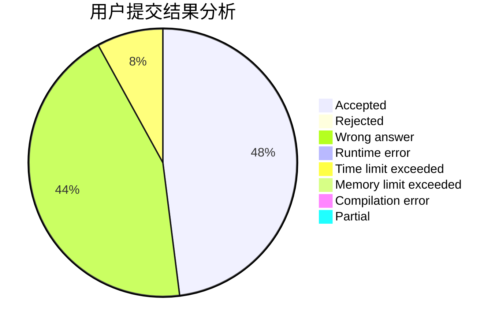
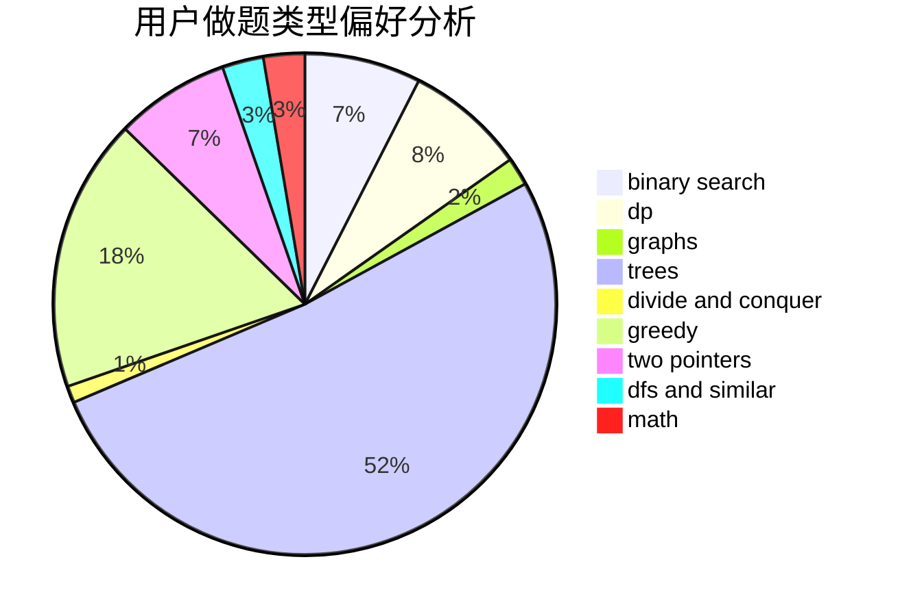

# Tangent617

<!-- tabs:start -->

#### **用户提交结果分析**

#### **用户做题类型偏好分析**

<!-- tabs:end -->
# 推荐题目
[1276F](https://codeforces.com/contest/1276/problem/F)
[940A](https://codeforces.com/contest/940/problem/A)
[1016B](https://codeforces.com/contest/1016/problem/B)
[1080E](https://codeforces.com/contest/1080/problem/E)
[494E](https://codeforces.com/contest/494/problem/E)
[616E](https://codeforces.com/contest/616/problem/E)
[582C](https://codeforces.com/contest/582/problem/C)
[1281E](https://codeforces.com/contest/1281/problem/E)
[1041B](https://codeforces.com/contest/1041/problem/B)
[251D](https://codeforces.com/contest/251/problem/D)
