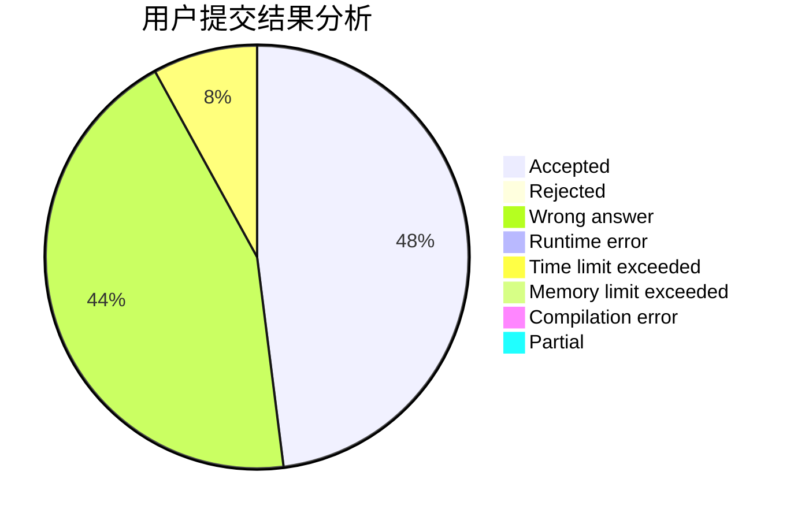
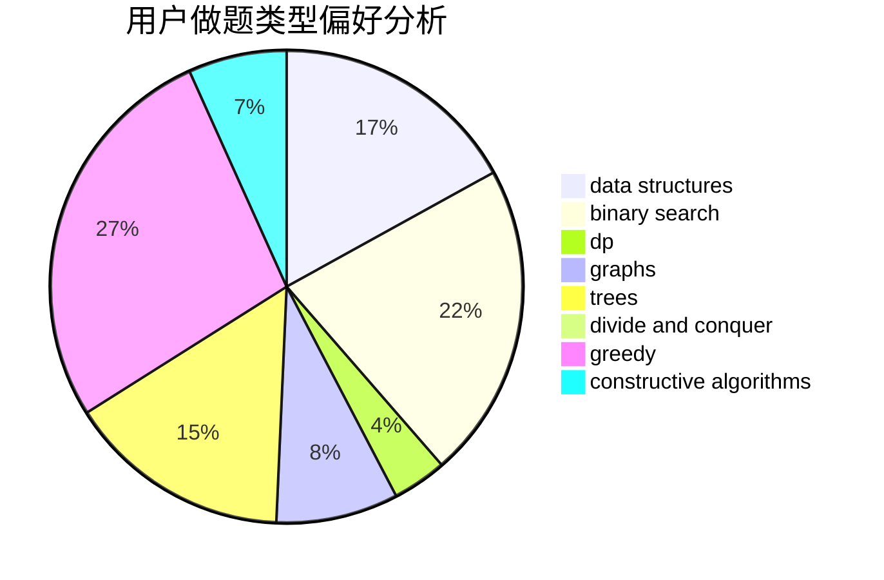
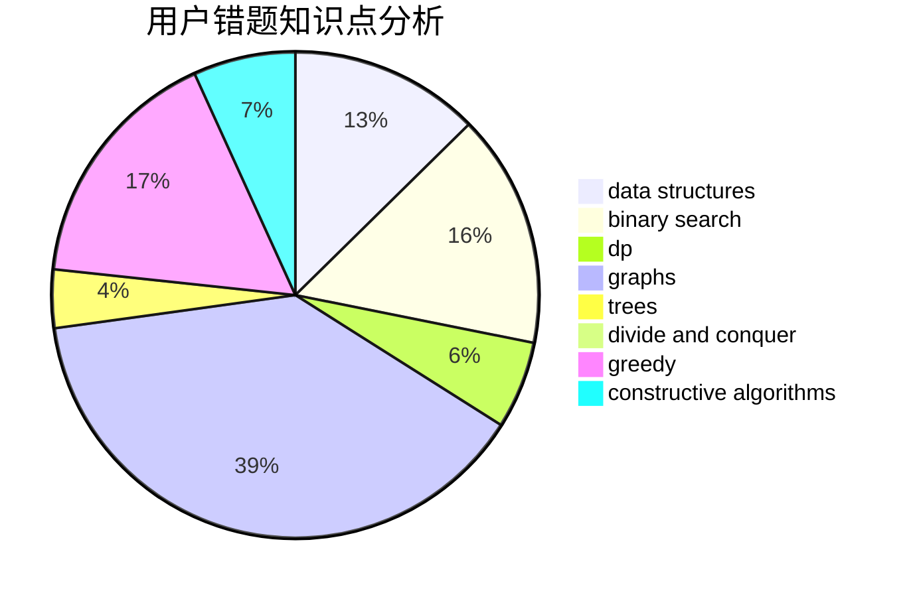

# Tangent617

<!-- tabs:start -->

#### **用户提交结果分析**

#### **用户做题类型偏好分析**

#### **用户错题知识点分析**

<!-- tabs:end -->
# 推荐题目
[1267K](https://codeforces.com/contest/1267/problem/K)		combinatorics,
                        math		  
[920A](https://codeforces.com/contest/920/problem/A)		implementation		  
[1015E2](https://codeforces.com/contest/1015E/problem/2)		binary search,
                        dp,
                        greedy		  
[1080B](https://codeforces.com/contest/1080/problem/B)		math		  
[476A](https://codeforces.com/contest/476/problem/A)		implementation,
                        math		  
[598F](https://codeforces.com/contest/598/problem/F)		geometry		  
[559E](https://codeforces.com/contest/559/problem/E)		dp,
                        sortings		  
[1272C](https://codeforces.com/contest/1272/problem/C)		combinatorics,
                        dp,
                        implementation		  
[1040B](https://codeforces.com/contest/1040/problem/B)		dp,
                        greedy,
                        math		  
[231A](https://codeforces.com/contest/231/problem/A)		brute force,
                        greedy		  
