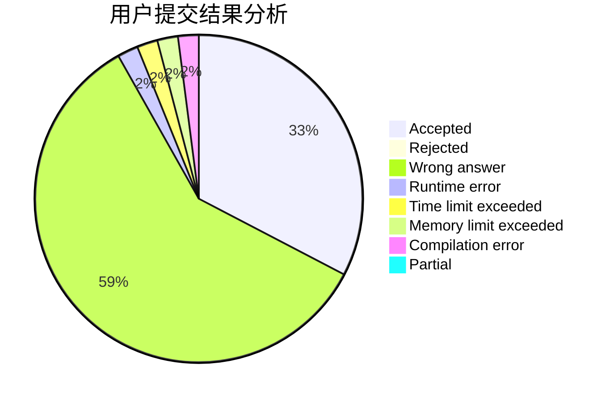
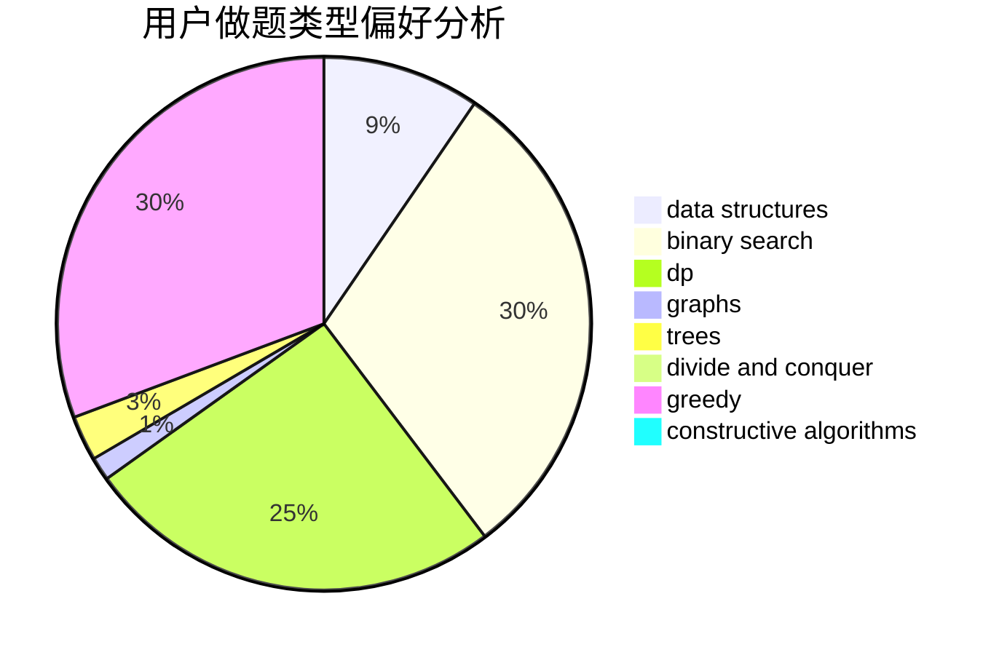
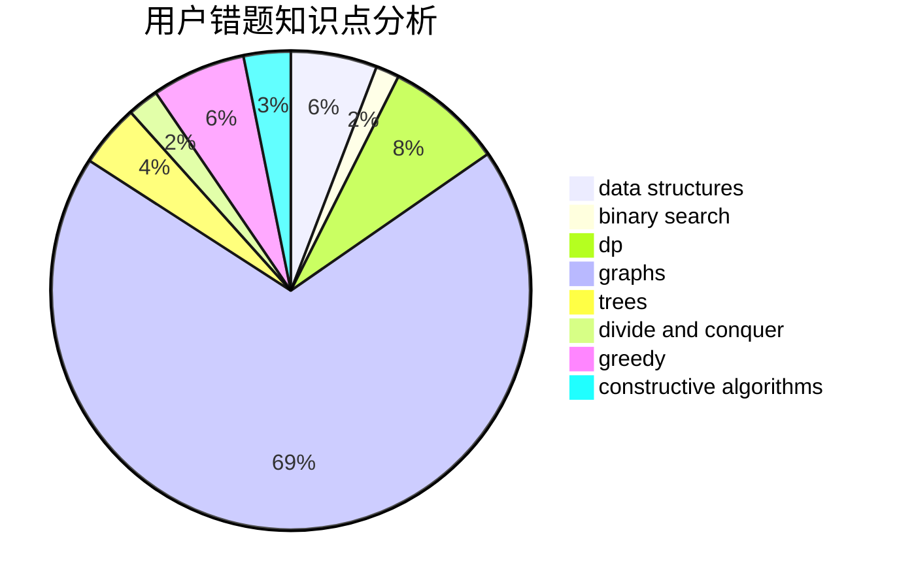

# TankYoung

<!-- tabs:start -->

#### **用户提交结果分析**

#### **用户做题类型偏好分析**

#### **用户错题知识点分析**

<!-- tabs:end -->
# 推荐题目
[906C](https://codeforces.com/contest/906/problem/C)		bitmasks,
                        brute force,
                        dp,
                        graphs		  
[919D](https://codeforces.com/contest/919/problem/D)		dfs and similar,
                        dp,
                        graphs		  
[383E](https://codeforces.com/contest/383/problem/E)		combinatorics,
                        divide and conquer,
                        dp		  
[376A](https://codeforces.com/contest/376/problem/A)		implementation,
                        math		  
[1082F](https://codeforces.com/contest/1082/problem/F)		dp,
                        strings,
                        trees		  
[1227A](https://codeforces.com/contest/1227/problem/A)		math		  
[724F](https://codeforces.com/contest/724/problem/F)		combinatorics,
                        dp,
                        trees		  
[1387A](https://codeforces.com/contest/1387/problem/A)		*special problem,
                        binary search,
                        dfs and similar,
                        dp,
                        math,
                        ternary search		  
[232A](https://codeforces.com/contest/232/problem/A)		binary search,
                        constructive algorithms,
                        graphs,
                        greedy		  
[1341D](https://codeforces.com/contest/1341/problem/D)		dsu,graphs,sortings,trees		  
