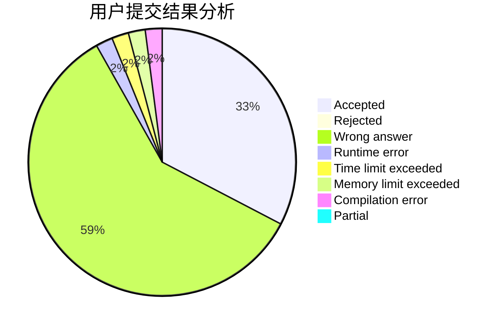
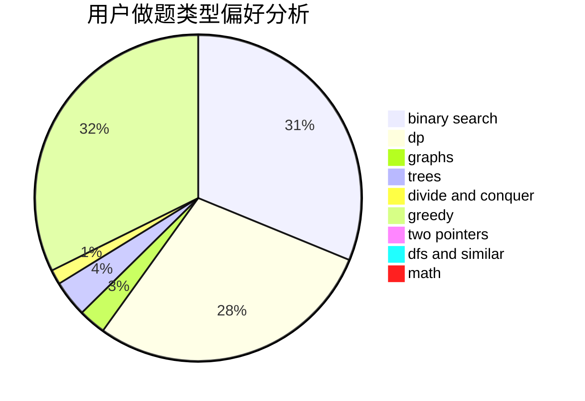

# TankYoung

<!-- tabs:start -->

#### **用户提交结果分析**

#### **用户做题类型偏好分析**

<!-- tabs:end -->
# 推荐题目
[906C](https://codeforces.com/contest/906/problem/C)
[919D](https://codeforces.com/contest/919/problem/D)
[383E](https://codeforces.com/contest/383/problem/E)
[376A](https://codeforces.com/contest/376/problem/A)
[1082F](https://codeforces.com/contest/1082/problem/F)
[1227A](https://codeforces.com/contest/1227/problem/A)
[724F](https://codeforces.com/contest/724/problem/F)
[1387A](https://codeforces.com/contest/1387/problem/A)
[232A](https://codeforces.com/contest/232/problem/A)
[1341D](https://codeforces.com/contest/1341/problem/D)
