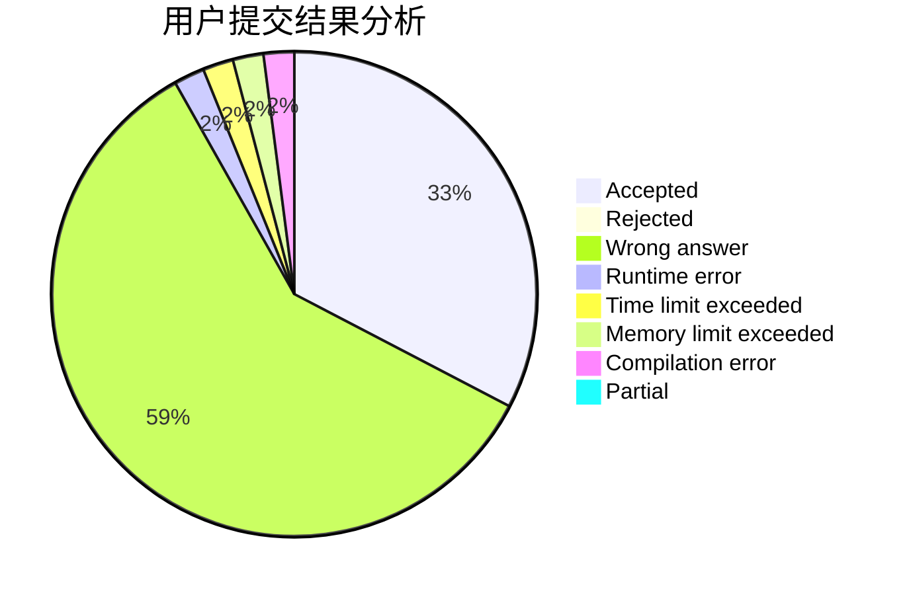
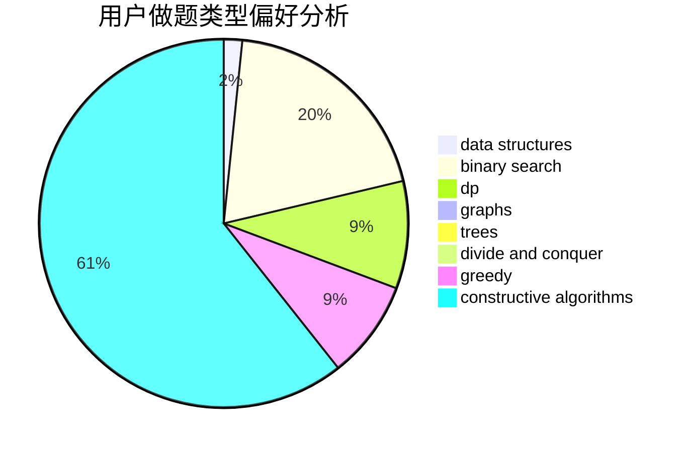
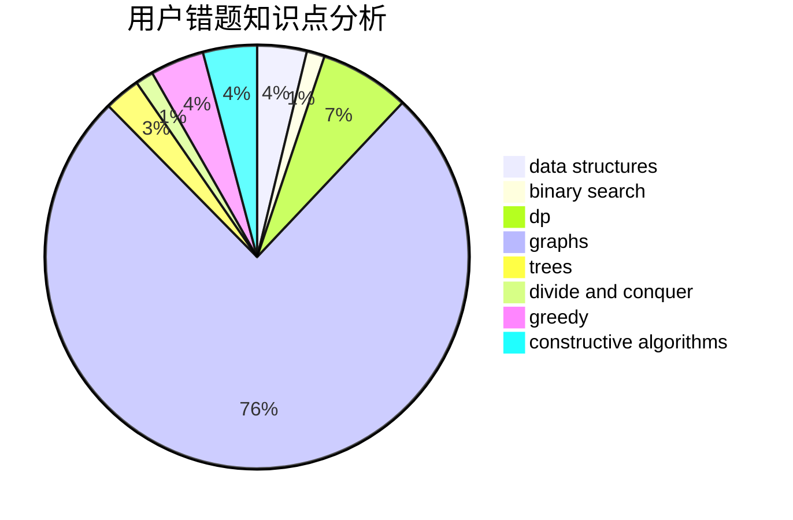

# TankYoung

<!-- tabs:start -->

#### **用户提交结果分析**

#### **用户做题类型偏好分析**

#### **用户错题知识点分析**

<!-- tabs:end -->
# 推荐题目
[887B](https://codeforces.com/contest/887/problem/B)		brute force,
                        implementation		  
[903D](https://codeforces.com/contest/903/problem/D)		data structures,
                        math		  
[358D](https://codeforces.com/contest/358/problem/D)		dp,
                        greedy		  
[349B](https://codeforces.com/contest/349/problem/B)		data structures,
                        dp,
                        greedy,
                        implementation		  
[1082C](https://codeforces.com/contest/1082/problem/C)		greedy,
                        sortings		  
[121C](https://codeforces.com/contest/121/problem/C)		brute force,
                        combinatorics,
                        number theory		  
[706A](https://codeforces.com/contest/706/problem/A)		brute force,
                        geometry,
                        implementation		  
[1378A2](https://codeforces.com/contest/1378A/problem/2)		dsu,graphs,sortings,trees		  
[212A](https://codeforces.com/contest/212/problem/A)		flows,
                        graphs		  
[1334E](https://codeforces.com/contest/1334/problem/E)		combinatorics,
                        graphs,
                        greedy,
                        math,
                        number theory		  
