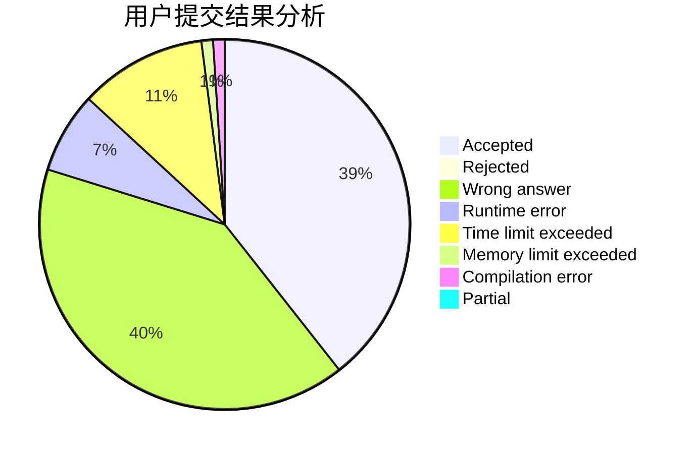
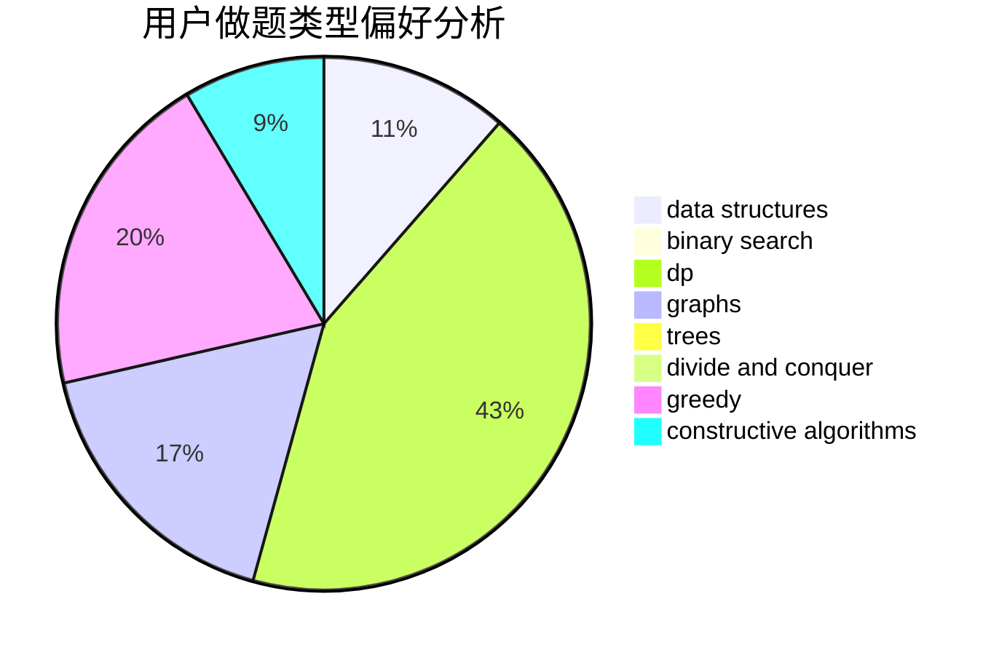
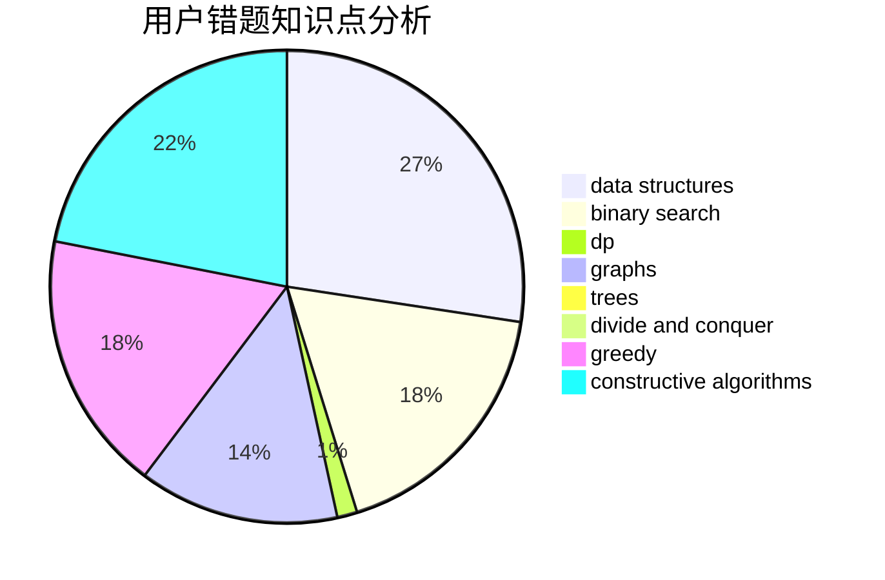

# TargetLocked

<!-- tabs:start -->

#### **用户提交结果分析**

#### **用户做题类型偏好分析**

#### **用户错题知识点分析**

<!-- tabs:end -->
# 推荐题目
[1033D](https://codeforces.com/contest/1033/problem/D)		interactive,
                        math,
                        number theory		  
[1343F](https://codeforces.com/contest/1343/problem/F)		brute force,
                        constructive algorithms,
                        data structures,
                        greedy,
                        implementation		  
[285A](https://codeforces.com/contest/285/problem/A)		greedy,
                        implementation		  
[1340E](https://codeforces.com/contest/1340/problem/E)		graphs,
                        interactive,
                        probabilities		  
[274B](https://codeforces.com/contest/274/problem/B)		dfs and similar,
                        dp,
                        greedy,
                        trees		  
[10D](https://codeforces.com/contest/10/problem/D)		dp		  
[1082F](https://codeforces.com/contest/1082/problem/F)		dp,
                        strings,
                        trees		  
[1371F](https://codeforces.com/contest/1371/problem/F)		data structures,
                        divide and conquer,
                        implementation		  
[632C](https://codeforces.com/contest/632/problem/C)		sortings,
                        strings		  
[616C](https://codeforces.com/contest/616/problem/C)		dfs and similar		  
