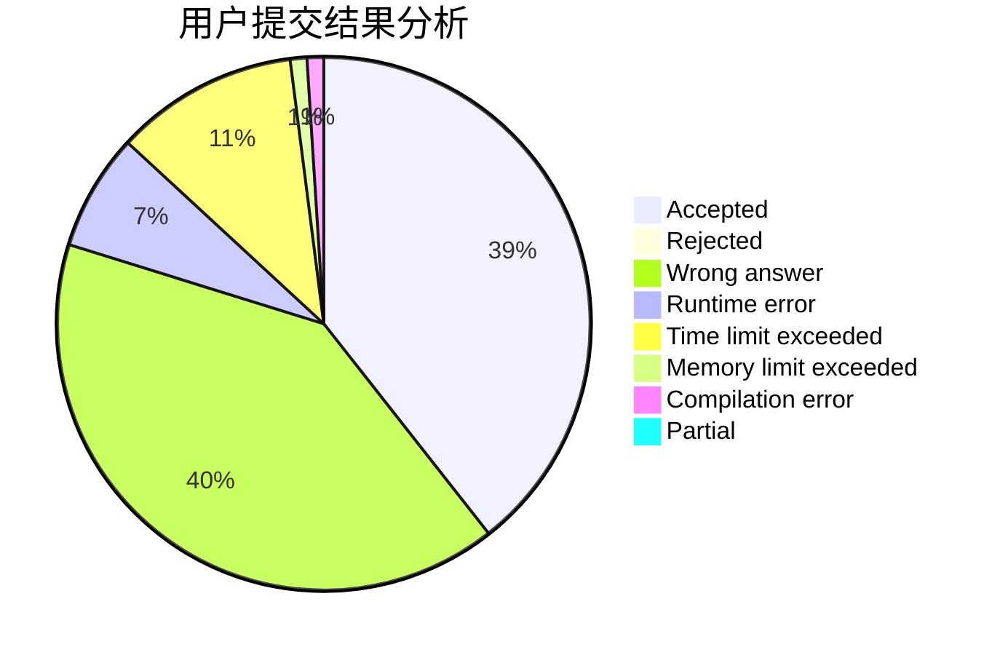
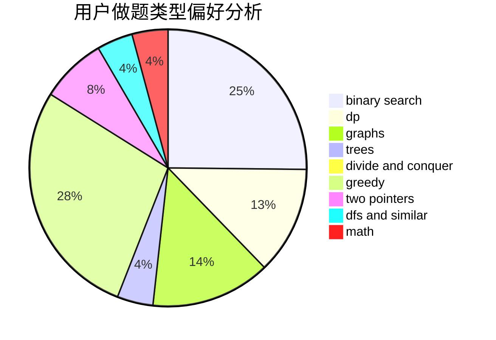

# TargetLocked

<!-- tabs:start -->

#### **用户提交结果分析**

#### **用户做题类型偏好分析**

<!-- tabs:end -->
# 推荐题目
[1033G](https://codeforces.com/contest/1033/problem/G)
[1350D](https://codeforces.com/contest/1350/problem/D)
[2C](https://codeforces.com/contest/2/problem/C)
[1347D](https://codeforces.com/contest/1347/problem/D)
[28A](https://codeforces.com/contest/28/problem/A)
[1100B](https://codeforces.com/contest/1100/problem/B)
[1083B](https://codeforces.com/contest/1083/problem/B)
[1380E](https://codeforces.com/contest/1380/problem/E)
[663E](https://codeforces.com/contest/663/problem/E)
[633H](https://codeforces.com/contest/633/problem/H)
