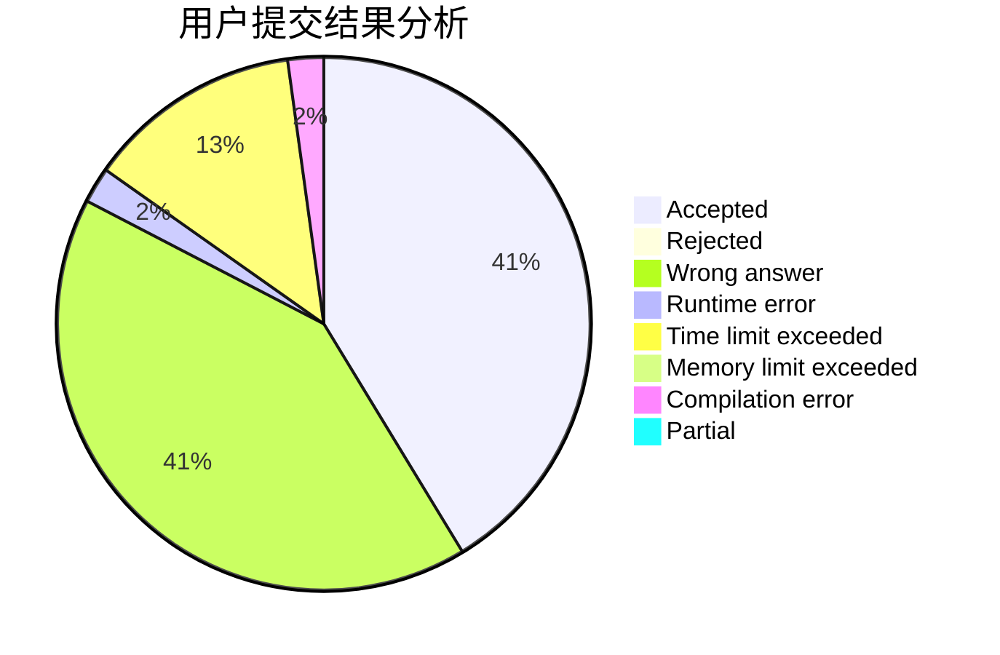
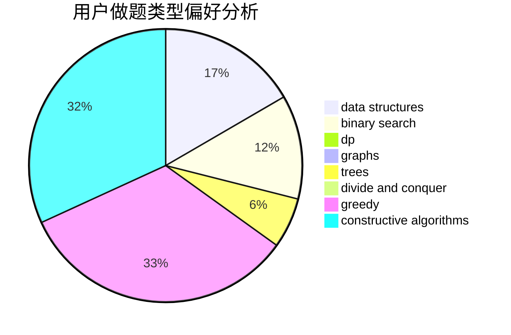
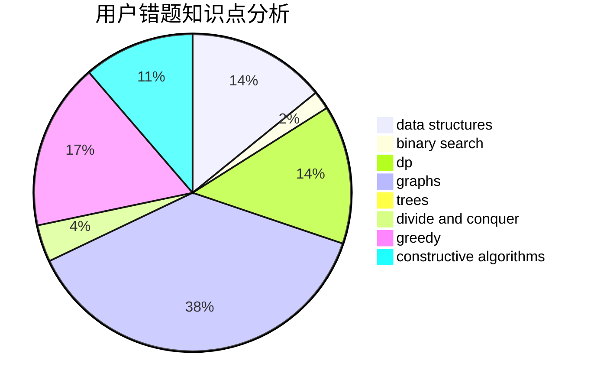

# TechAoba

<!-- tabs:start -->

#### **用户提交结果分析**

#### **用户做题类型偏好分析**

#### **用户错题知识点分析**

<!-- tabs:end -->
# 推荐题目
[743E](https://codeforces.com/contest/743/problem/E)		binary search,
                        bitmasks,
                        brute force,
                        dp		  
[304B](https://codeforces.com/contest/304/problem/B)		brute force,
                        implementation		  
[872C](https://codeforces.com/contest/872/problem/C)		dsu,graphs,sortings,trees		  
[56B](https://codeforces.com/contest/56/problem/B)		implementation		  
[1051A](https://codeforces.com/contest/1051/problem/A)		greedy,
                        implementation,
                        strings		  
[679B](https://codeforces.com/contest/679/problem/B)		binary search,
                        dp,
                        greedy		  
[356E](https://codeforces.com/contest/356/problem/E)		dp,
                        hashing,
                        implementation,
                        string suffix structures,
                        strings		  
[1207C](https://codeforces.com/contest/1207/problem/C)		dp,
                        greedy		  
[934B](https://codeforces.com/contest/934/problem/B)		constructive algorithms,
                        implementation		  
[825D](https://codeforces.com/contest/825/problem/D)		binary search,
                        greedy,
                        implementation		  
