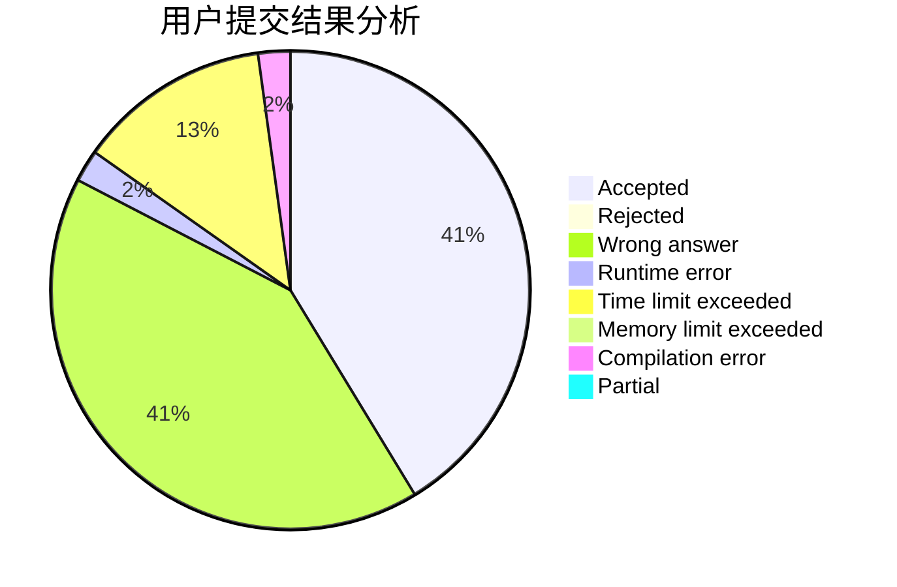
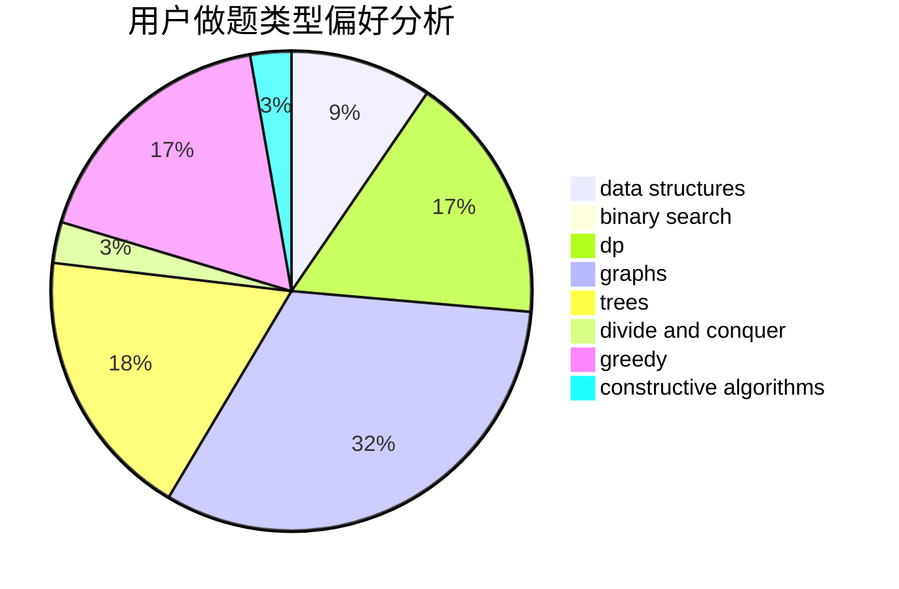

# TechAoba

<!-- tabs:start -->

#### **用户提交结果分析**

#### **用户做题类型偏好分析**

#### **用户错题知识点分析**

<!-- tabs:end -->
# 推荐题目
[764A](https://codeforces.com/contest/764/problem/A)		brute force,
                        implementation,
                        math		  
[323C](https://codeforces.com/contest/323/problem/C)		data structures		  
[893E](https://codeforces.com/contest/893/problem/E)		combinatorics,
                        dp,
                        math,
                        number theory		  
[58E](https://codeforces.com/contest/58/problem/E)		dp		  
[1051D](https://codeforces.com/contest/1051/problem/D)		bitmasks,
                        dp		  
[703A](https://codeforces.com/contest/703/problem/A)		implementation		  
[383A](https://codeforces.com/contest/383/problem/A)		data structures,
                        greedy		  
[12131](https://codeforces.com/contest/1213/problem/1)		dsu,graphs,sortings,trees		  
[956A](https://codeforces.com/contest/956/problem/A)		dsu,graphs,sortings,trees		  
[844A](https://codeforces.com/contest/844/problem/A)		greedy,
                        implementation,
                        strings		  
