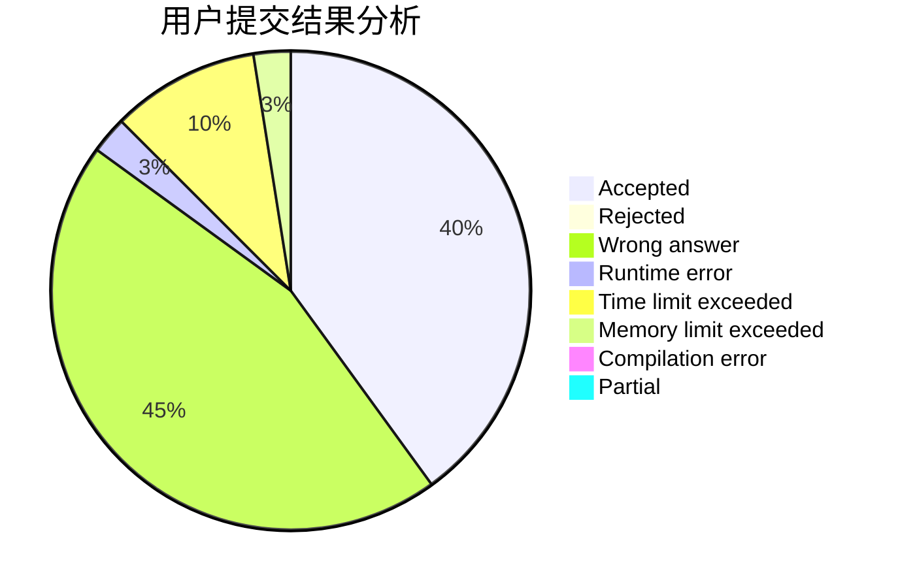
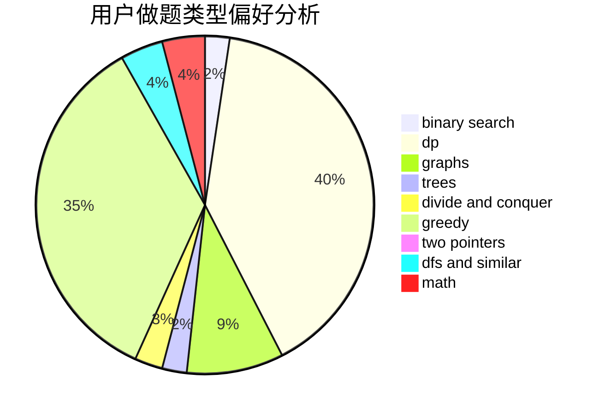

# TetrisCandy

<!-- tabs:start -->

#### **用户提交结果分析**

#### **用户做题类型偏好分析**

<!-- tabs:end -->
# 推荐题目
[67A](https://codeforces.com/contest/67/problem/A)
[241E](https://codeforces.com/contest/241/problem/E)
[718D](https://codeforces.com/contest/718/problem/D)
[1364E](https://codeforces.com/contest/1364/problem/E)
[82A](https://codeforces.com/contest/82/problem/A)
[1107D](https://codeforces.com/contest/1107/problem/D)
[985B](https://codeforces.com/contest/985/problem/B)
[416D](https://codeforces.com/contest/416/problem/D)
[1191A](https://codeforces.com/contest/1191/problem/A)
[1299B](https://codeforces.com/contest/1299/problem/B)
