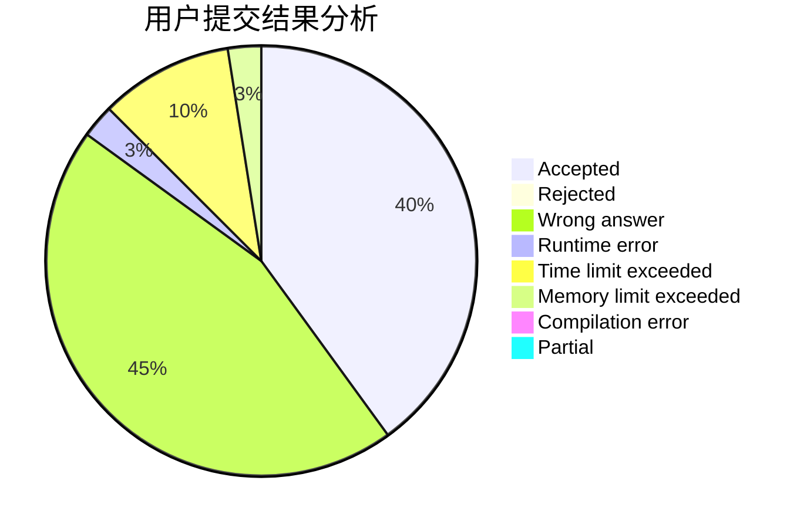
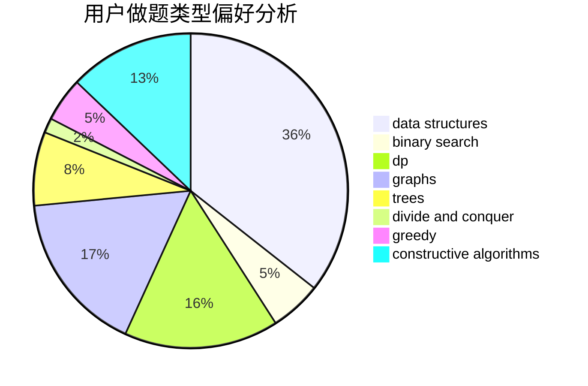
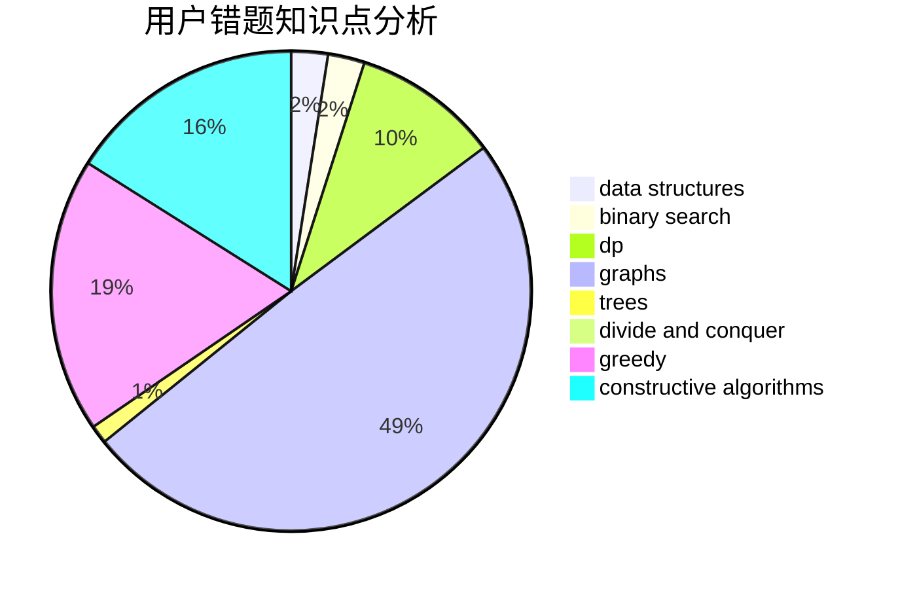

# TetrisCandy

<!-- tabs:start -->

#### **用户提交结果分析**

#### **用户做题类型偏好分析**

#### **用户错题知识点分析**

<!-- tabs:end -->
# 推荐题目
[67A](https://codeforces.com/contest/67/problem/A)		dp,
                        graphs,
                        greedy,
                        implementation		  
[241E](https://codeforces.com/contest/241/problem/E)		graphs,
                        shortest paths		  
[718D](https://codeforces.com/contest/718/problem/D)		dp,
                        hashing,
                        trees		  
[1364E](https://codeforces.com/contest/1364/problem/E)		bitmasks,
                        constructive algorithms,
                        divide and conquer,
                        interactive,
                        probabilities		  
[82A](https://codeforces.com/contest/82/problem/A)		implementation,
                        math		  
[1107D](https://codeforces.com/contest/1107/problem/D)		dp,
                        implementation,
                        math,
                        number theory		  
[985B](https://codeforces.com/contest/985/problem/B)		implementation		  
[416D](https://codeforces.com/contest/416/problem/D)		greedy,
                        implementation,
                        math		  
[1191A](https://codeforces.com/contest/1191/problem/A)		brute force		  
[1299B](https://codeforces.com/contest/1299/problem/B)		geometry		  
