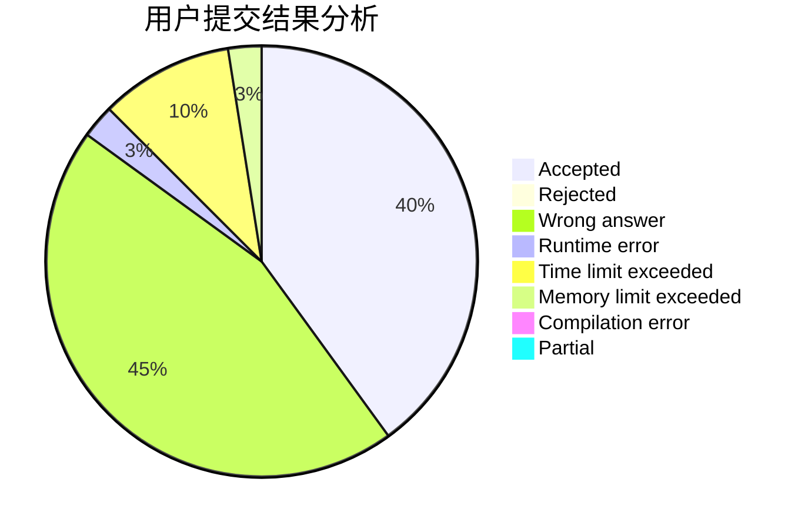
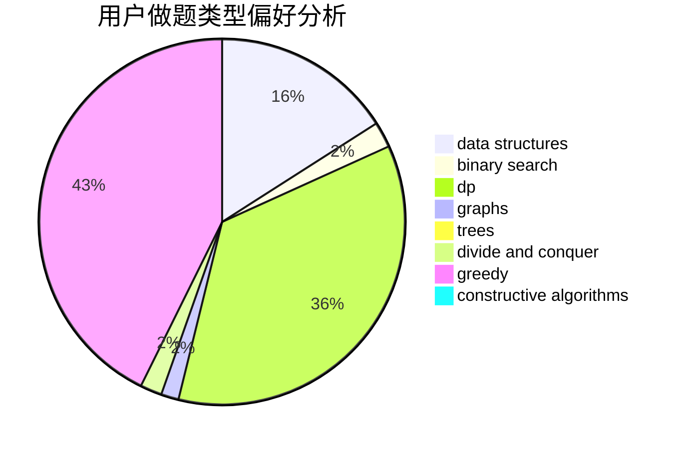
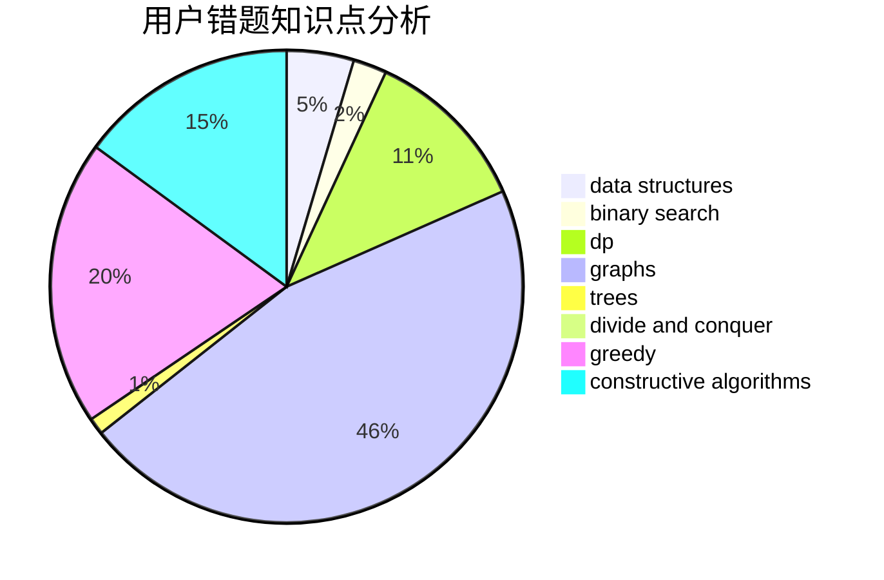

# TetrisCandy

<!-- tabs:start -->

#### **用户提交结果分析**

#### **用户做题类型偏好分析**

#### **用户错题知识点分析**

<!-- tabs:end -->
# 推荐题目
[659F](https://codeforces.com/contest/659/problem/F)		dfs and similar,
                        dsu,
                        graphs,
                        greedy,
                        sortings		  
[223C](https://codeforces.com/contest/223/problem/C)		combinatorics,
                        math,
                        number theory		  
[700C](https://codeforces.com/contest/700/problem/C)		dfs and similar,
                        graphs		  
[1357B2](https://codeforces.com/contest/1357B/problem/2)		nan		  
[811A](https://codeforces.com/contest/811/problem/A)		brute force,
                        implementation		  
[1107A](https://codeforces.com/contest/1107/problem/A)		greedy,
                        strings		  
[962C](https://codeforces.com/contest/962/problem/C)		brute force,
                        implementation,
                        math		  
[387C](https://codeforces.com/contest/387/problem/C)		greedy,
                        implementation		  
[1187D](https://codeforces.com/contest/1187/problem/D)		data structures,
                        sortings		  
[1292B](https://codeforces.com/contest/1292/problem/B)		brute force,
                        constructive algorithms,
                        geometry,
                        greedy,
                        implementation		  
