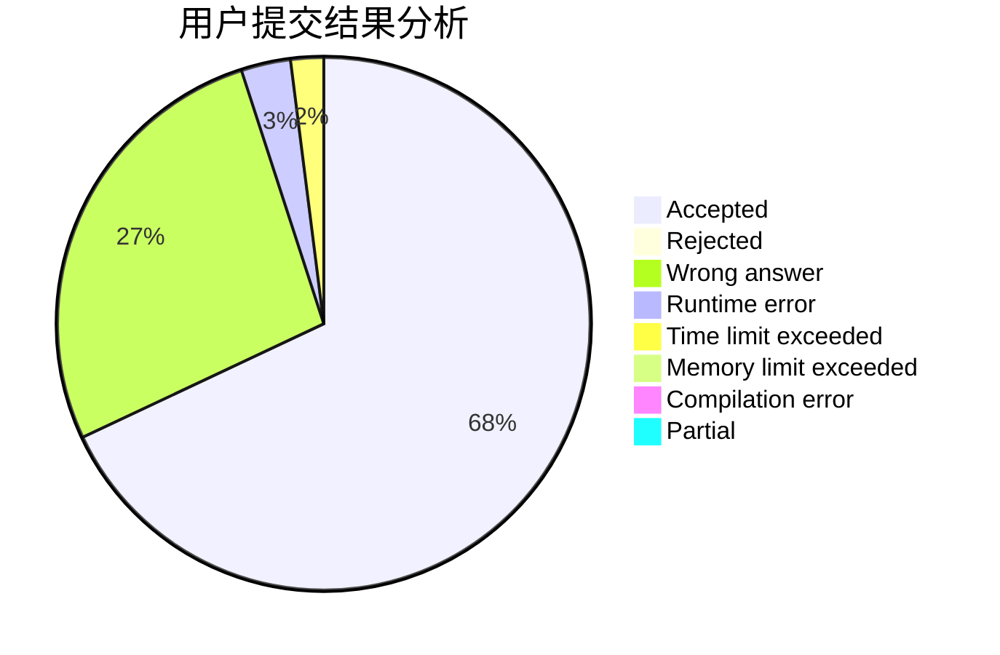
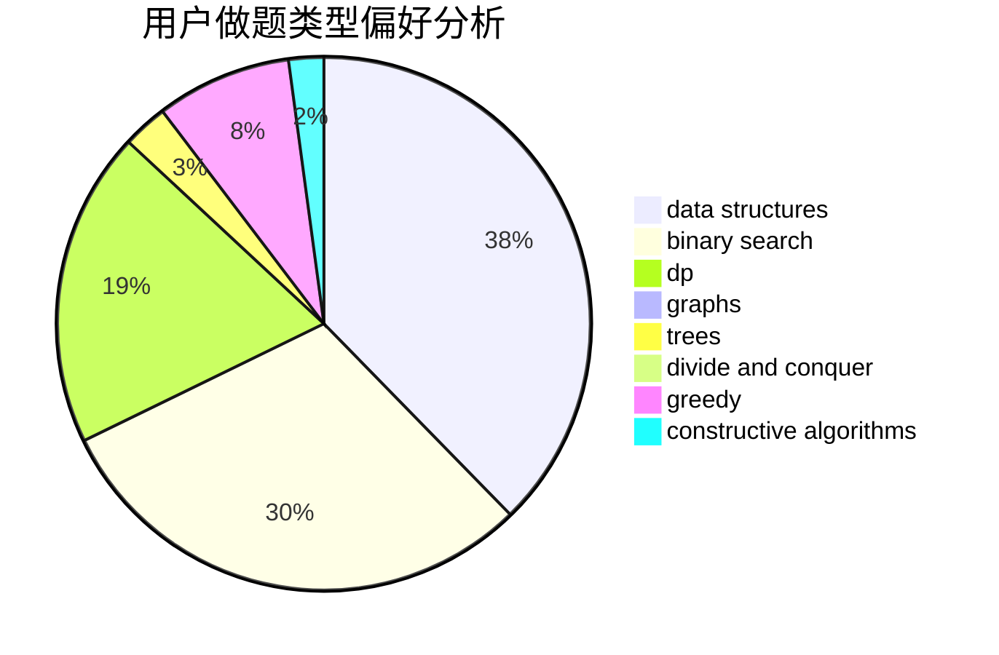
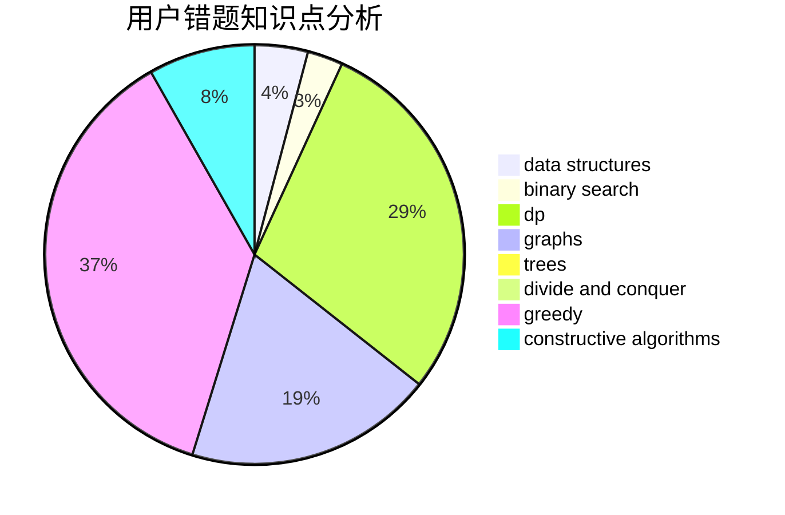

# Thallium54

<!-- tabs:start -->

#### **用户提交结果分析**

#### **用户做题类型偏好分析**

#### **用户错题知识点分析**

<!-- tabs:end -->
# 推荐题目
[1293D](https://codeforces.com/contest/1293/problem/D)		dsu,graphs,sortings,trees		  
[96B](https://codeforces.com/contest/96/problem/B)		binary search,
                        bitmasks,
                        brute force		  
[962F](https://codeforces.com/contest/962/problem/F)		dfs and similar,
                        graphs,
                        trees		  
[542F](https://codeforces.com/contest/542/problem/F)		dp,
                        greedy		  
[61B](https://codeforces.com/contest/61/problem/B)		strings		  
[1009A](https://codeforces.com/contest/1009/problem/A)		implementation		  
[1042D](https://codeforces.com/contest/1042/problem/D)		data structures,
                        divide and conquer,
                        two pointers		  
[1413F](https://codeforces.com/contest/1413/problem/F)		data structures,
                        trees		  
[1170E](https://codeforces.com/contest/1170/problem/E)		*special problem,
                        binary search		  
[149E](https://codeforces.com/contest/149/problem/E)		string suffix structures,
                        strings		  
