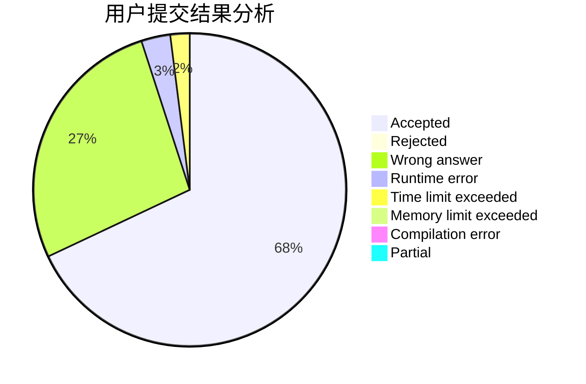
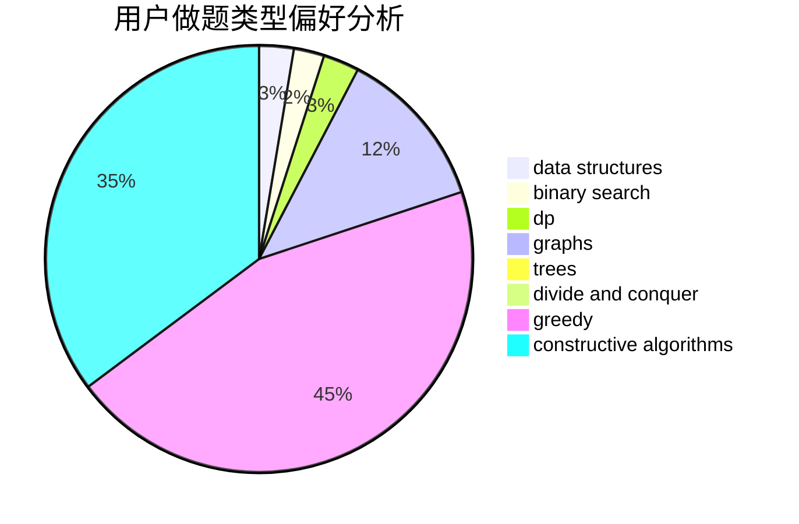
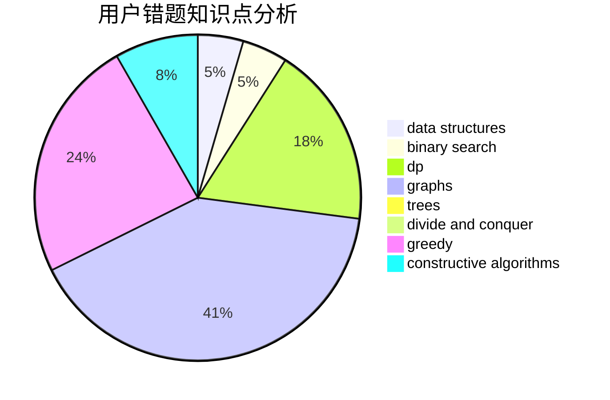

# Thallium54

<!-- tabs:start -->

#### **用户提交结果分析**

#### **用户做题类型偏好分析**

#### **用户错题知识点分析**

<!-- tabs:end -->
# 推荐题目
[1286C1](https://codeforces.com/contest/1286C/problem/1)		brute force,
                        constructive algorithms,
                        interactive,
                        math		  
[952A](https://codeforces.com/contest/952/problem/A)		math		  
[946B](https://codeforces.com/contest/946/problem/B)		math,
                        number theory		  
[515E](https://codeforces.com/contest/515/problem/E)		data structures		  
[600C](https://codeforces.com/contest/600/problem/C)		constructive algorithms,
                        greedy,
                        strings		  
[1008C](https://codeforces.com/contest/1008/problem/C)		dsu,graphs,sortings,trees		  
[1042A](https://codeforces.com/contest/1042/problem/A)		binary search,
                        implementation		  
[1403A](https://codeforces.com/contest/1403/problem/A)		*special problem,
                        2-sat,
                        binary search,
                        data structures,
                        graphs,
                        interactive,
                        sortings,
                        two pointers		  
[1167A](https://codeforces.com/contest/1167/problem/A)		brute force,
                        greedy,
                        strings		  
[1491C](https://codeforces.com/contest/1491/problem/C)		brute force,
                        data structures,
                        dp,
                        greedy,
                        implementation		  
