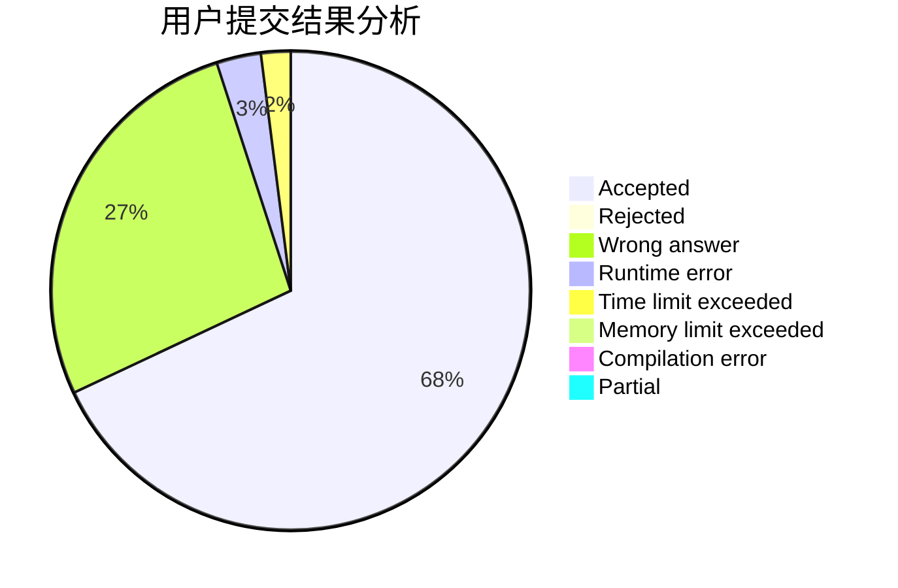
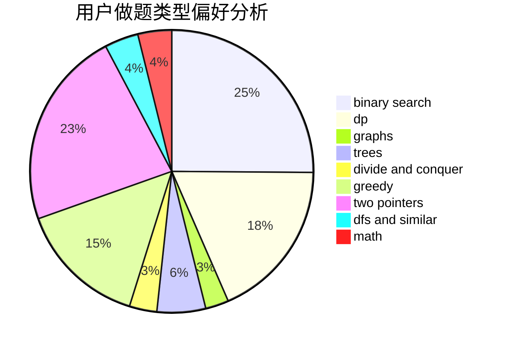

# Thallium54

<!-- tabs:start -->

#### **用户提交结果分析**

#### **用户做题类型偏好分析**

<!-- tabs:end -->
# 推荐题目
[1293D](https://codeforces.com/contest/1293/problem/D)
[96B](https://codeforces.com/contest/96/problem/B)
[962F](https://codeforces.com/contest/962/problem/F)
[542F](https://codeforces.com/contest/542/problem/F)
[61B](https://codeforces.com/contest/61/problem/B)
[1009A](https://codeforces.com/contest/1009/problem/A)
[1042D](https://codeforces.com/contest/1042/problem/D)
[1413F](https://codeforces.com/contest/1413/problem/F)
[1170E](https://codeforces.com/contest/1170/problem/E)
[149E](https://codeforces.com/contest/149/problem/E)
