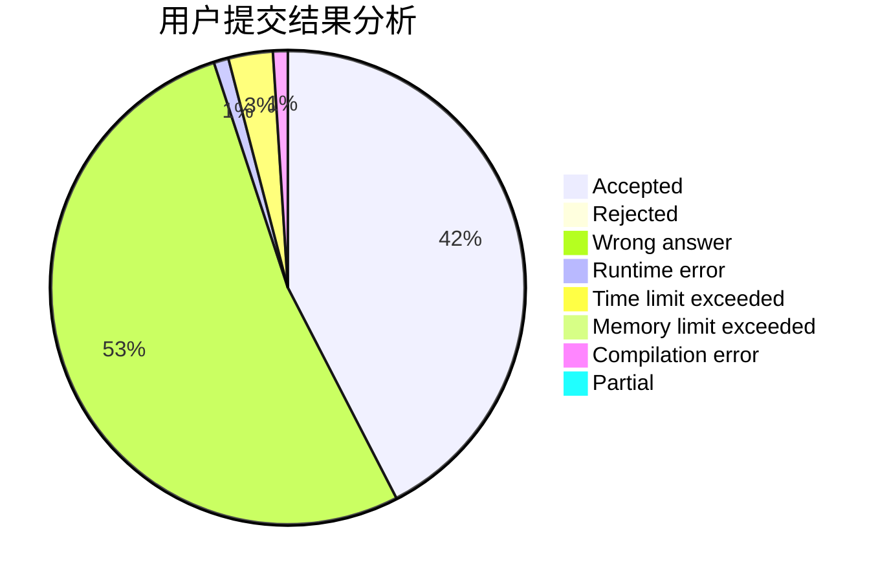
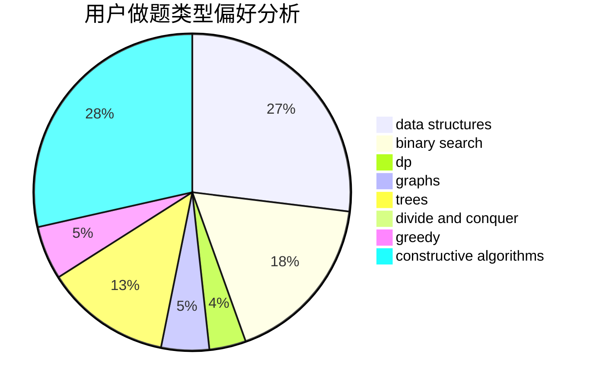

# ThatShyy

<!-- tabs:start -->

#### **用户提交结果分析**

#### **用户做题类型偏好分析**

#### **用户错题知识点分析**

<!-- tabs:end -->
# 推荐题目
[13A](https://codeforces.com/contest/13/problem/A)		implementation,
                        math		  
[1360D](https://codeforces.com/contest/1360/problem/D)		math,
                        number theory		  
[542E](https://codeforces.com/contest/542/problem/E)		graphs,
                        shortest paths		  
[434A](https://codeforces.com/contest/434/problem/A)		dsu,graphs,sortings,trees		  
[490F](https://codeforces.com/contest/490/problem/F)		data structures,
                        dfs and similar,
                        dp,
                        trees		  
[780E](https://codeforces.com/contest/780/problem/E)		constructive algorithms,
                        dfs and similar,
                        graphs		  
[549E](https://codeforces.com/contest/549/problem/E)		geometry,
                        math		  
[389B](https://codeforces.com/contest/389/problem/B)		greedy,
                        implementation		  
[955D](https://codeforces.com/contest/955/problem/D)		brute force,
                        strings		  
[776A](https://codeforces.com/contest/776/problem/A)		brute force,
                        implementation,
                        strings		  
