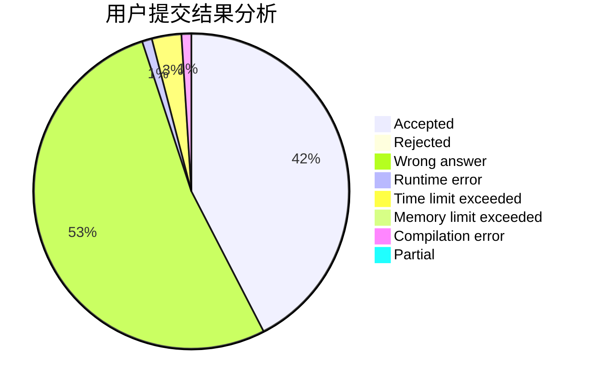
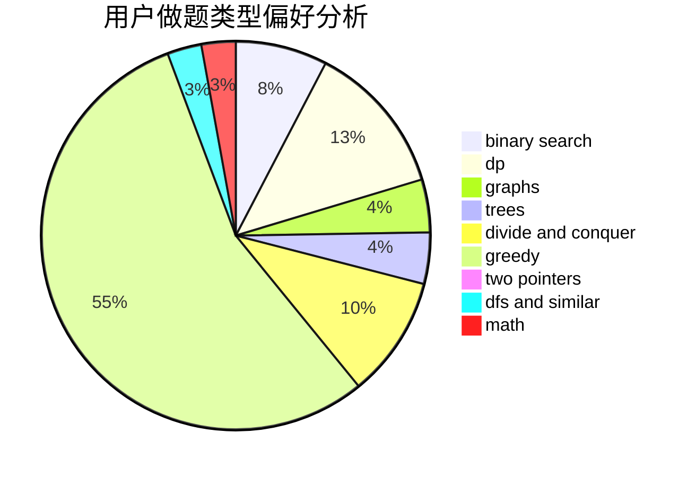

# ThatShyy

<!-- tabs:start -->

#### **用户提交结果分析**

#### **用户做题类型偏好分析**

<!-- tabs:end -->
# 推荐题目
[1409A](https://codeforces.com/contest/1409/problem/A)
[1368C](https://codeforces.com/contest/1368/problem/C)
[567A](https://codeforces.com/contest/567/problem/A)
[454A](https://codeforces.com/contest/454/problem/A)
[510E](https://codeforces.com/contest/510/problem/E)
[799D](https://codeforces.com/contest/799/problem/D)
[574C](https://codeforces.com/contest/574/problem/C)
[418D](https://codeforces.com/contest/418/problem/D)
[977D](https://codeforces.com/contest/977/problem/D)
[793G](https://codeforces.com/contest/793/problem/G)
