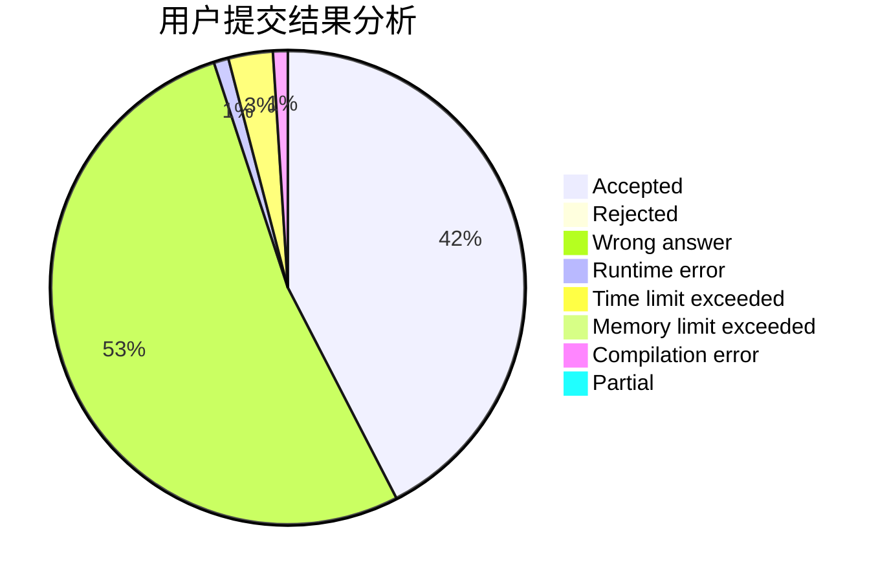
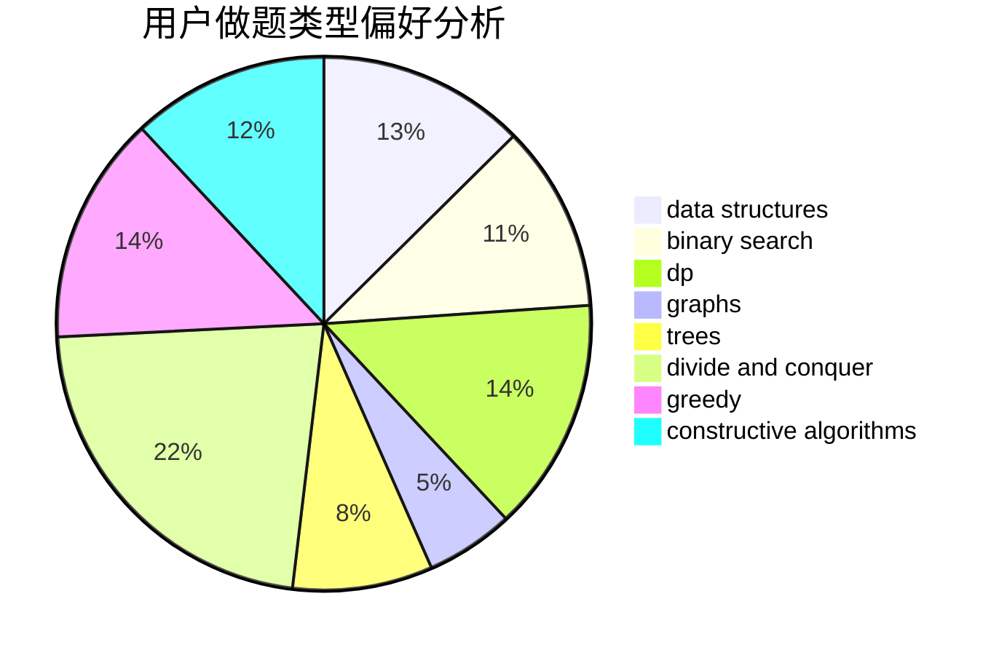

# ThatShyy

<!-- tabs:start -->

#### **用户提交结果分析**

#### **用户做题类型偏好分析**

#### **用户错题知识点分析**

<!-- tabs:end -->
# 推荐题目
[1409A](https://codeforces.com/contest/1409/problem/A)		greedy,
                        math		  
[1368C](https://codeforces.com/contest/1368/problem/C)		constructive algorithms		  
[567A](https://codeforces.com/contest/567/problem/A)		greedy,
                        implementation		  
[454A](https://codeforces.com/contest/454/problem/A)		implementation		  
[510E](https://codeforces.com/contest/510/problem/E)		flows		  
[799D](https://codeforces.com/contest/799/problem/D)		brute force,
                        dp,
                        meet-in-the-middle		  
[574C](https://codeforces.com/contest/574/problem/C)		dsu,graphs,sortings,trees		  
[418D](https://codeforces.com/contest/418/problem/D)		data structures,
                        graphs,
                        trees		  
[977D](https://codeforces.com/contest/977/problem/D)		dfs and similar,
                        math,
                        sortings		  
[793G](https://codeforces.com/contest/793/problem/G)		data structures,
                        divide and conquer,
                        flows,
                        graph matchings		  
