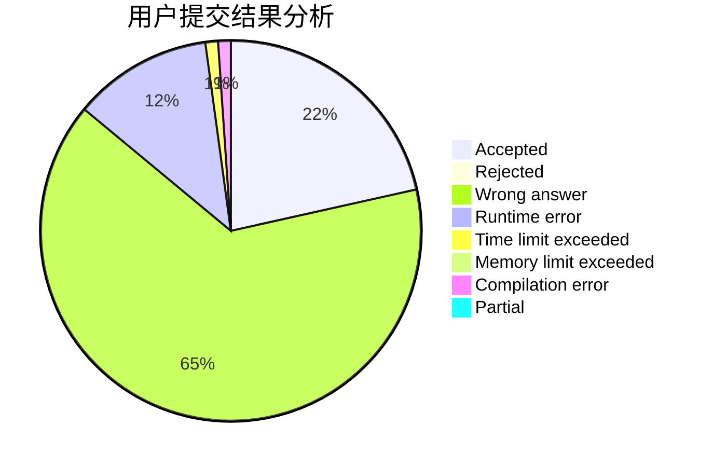
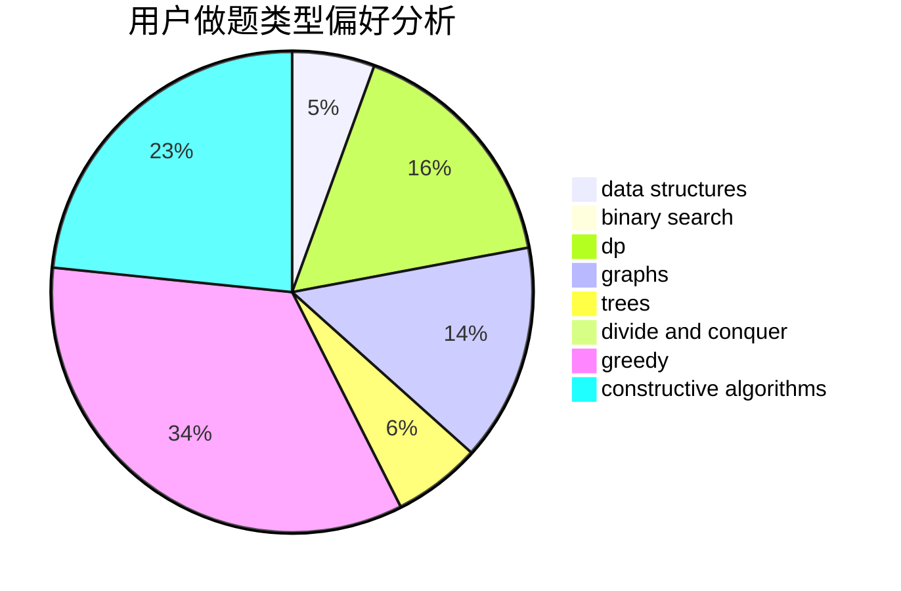
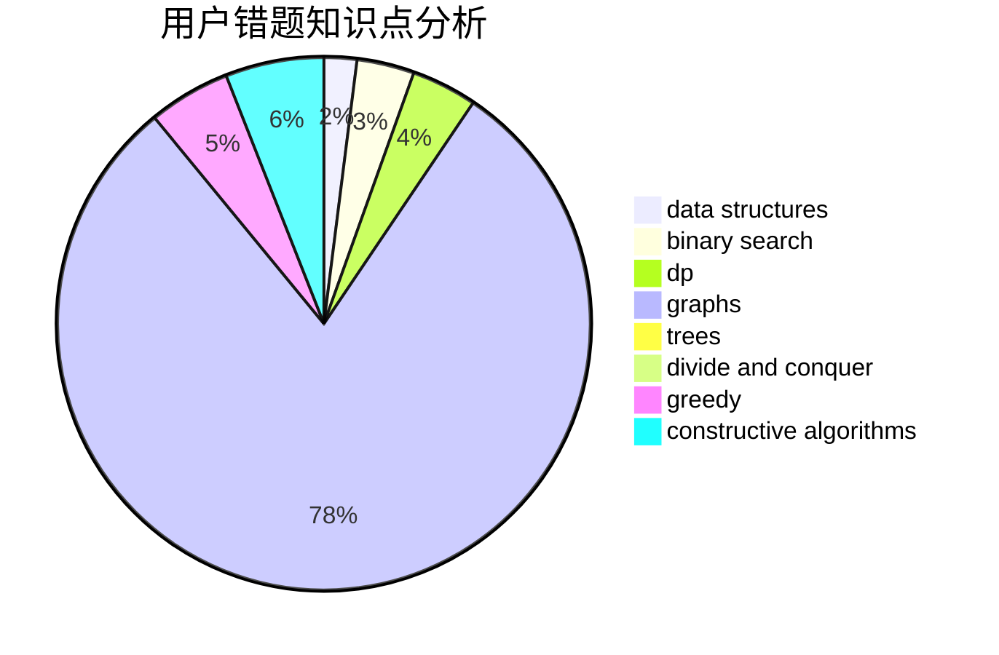

# The-Out-Land

<!-- tabs:start -->

#### **用户提交结果分析**

#### **用户做题类型偏好分析**

#### **用户错题知识点分析**

<!-- tabs:end -->
# 推荐题目
[950A](https://codeforces.com/contest/950/problem/A)		implementation,
                        math		  
[813F](https://codeforces.com/contest/813/problem/F)		data structures,
                        dsu,
                        graphs		  
[268E](https://codeforces.com/contest/268/problem/E)		math,
                        probabilities,
                        sortings		  
[831B](https://codeforces.com/contest/831/problem/B)		implementation,
                        strings		  
[1121B](https://codeforces.com/contest/1121/problem/B)		brute force,
                        implementation		  
[822A](https://codeforces.com/contest/822/problem/A)		implementation,
                        math,
                        number theory		  
[5131](https://codeforces.com/contest/513/problem/1)		dsu,graphs,sortings,trees		  
[575I](https://codeforces.com/contest/575/problem/I)		data structures		  
[873C](https://codeforces.com/contest/873/problem/C)		greedy,
                        two pointers		  
[924B](https://codeforces.com/contest/924/problem/B)		binary search,
                        greedy,
                        two pointers		  
