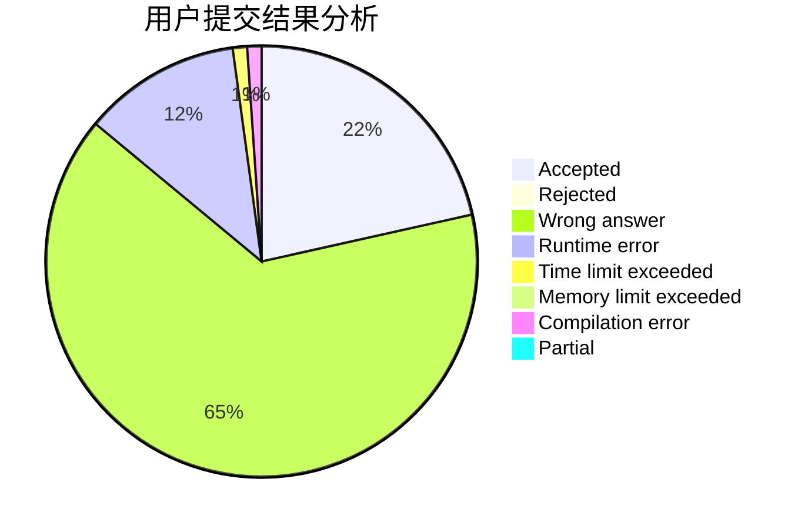
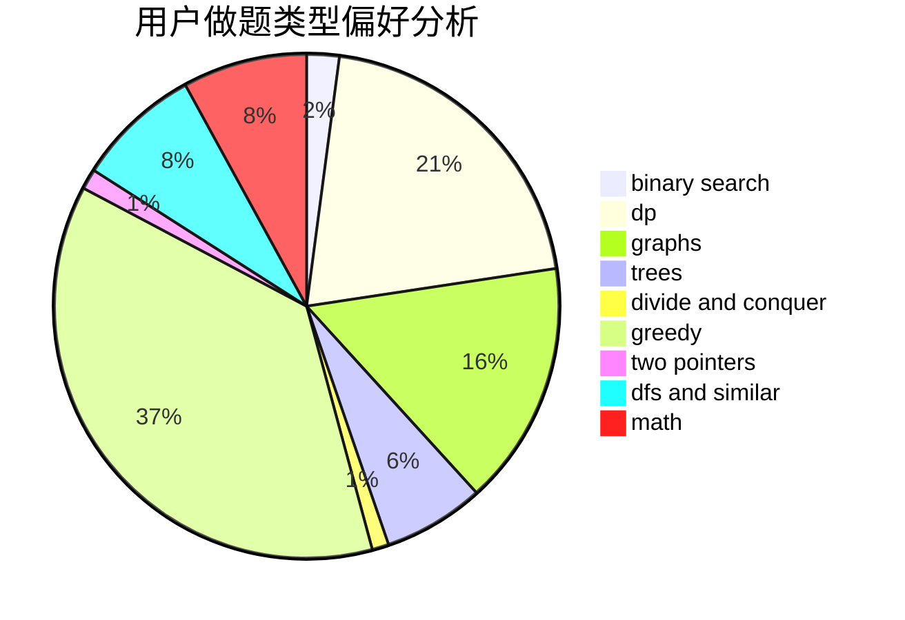

# The-Out-Land

<!-- tabs:start -->

#### **用户提交结果分析**

#### **用户做题类型偏好分析**

<!-- tabs:end -->
# 推荐题目
[950A](https://codeforces.com/contest/950/problem/A)
[813F](https://codeforces.com/contest/813/problem/F)
[268E](https://codeforces.com/contest/268/problem/E)
[831B](https://codeforces.com/contest/831/problem/B)
[1121B](https://codeforces.com/contest/1121/problem/B)
[822A](https://codeforces.com/contest/822/problem/A)
[5131](https://codeforces.com/contest/513/problem/1)
[575I](https://codeforces.com/contest/575/problem/I)
[873C](https://codeforces.com/contest/873/problem/C)
[924B](https://codeforces.com/contest/924/problem/B)
