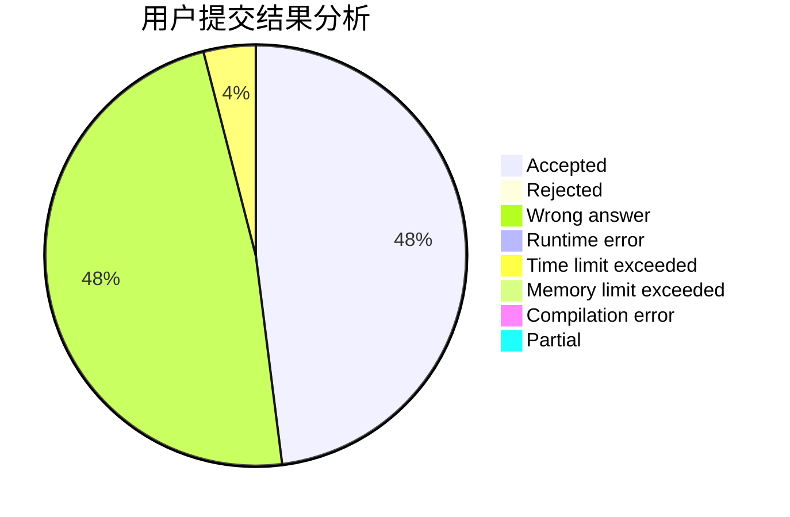
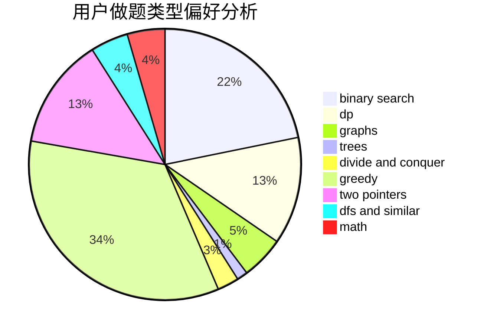

# TheBest

<!-- tabs:start -->

#### **用户提交结果分析**

#### **用户做题类型偏好分析**

<!-- tabs:end -->
# 推荐题目
[956D](https://codeforces.com/contest/956/problem/D)
[1215B](https://codeforces.com/contest/1215/problem/B)
[216D](https://codeforces.com/contest/216/problem/D)
[1336D](https://codeforces.com/contest/1336/problem/D)
[487B](https://codeforces.com/contest/487/problem/B)
[817D](https://codeforces.com/contest/817/problem/D)
[120J](https://codeforces.com/contest/120/problem/J)
[325E](https://codeforces.com/contest/325/problem/E)
[835D](https://codeforces.com/contest/835/problem/D)
[1286D](https://codeforces.com/contest/1286/problem/D)
