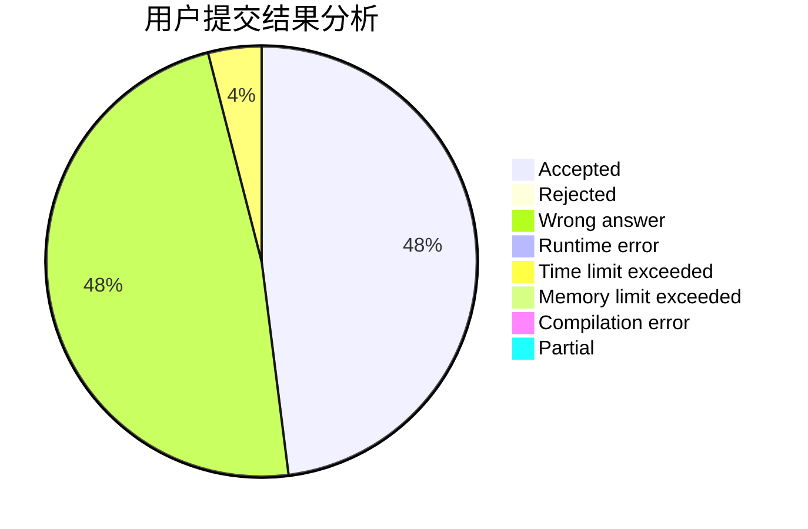
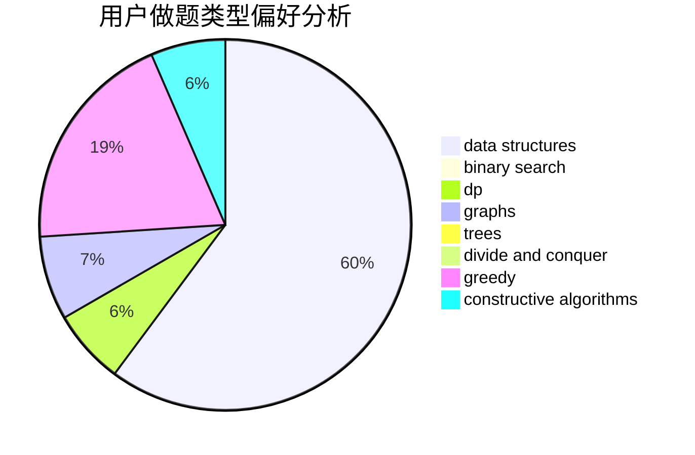
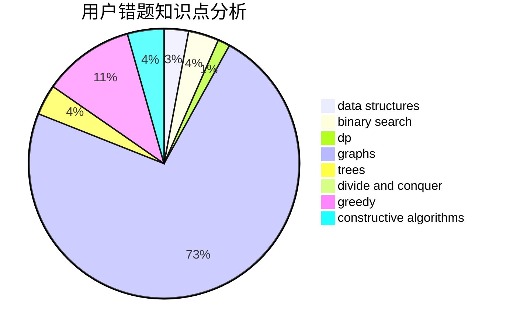

# TheBest

<!-- tabs:start -->

#### **用户提交结果分析**

#### **用户做题类型偏好分析**

#### **用户错题知识点分析**

<!-- tabs:end -->
# 推荐题目
[956D](https://codeforces.com/contest/956/problem/D)		dsu,graphs,sortings,trees		  
[1215B](https://codeforces.com/contest/1215/problem/B)		combinatorics,
                        dp,
                        implementation		  
[216D](https://codeforces.com/contest/216/problem/D)		binary search,
                        sortings,
                        two pointers		  
[1336D](https://codeforces.com/contest/1336/problem/D)		constructive algorithms,
                        interactive		  
[487B](https://codeforces.com/contest/487/problem/B)		binary search,
                        data structures,
                        dp,
                        two pointers		  
[817D](https://codeforces.com/contest/817/problem/D)		data structures,
                        divide and conquer,
                        dsu,
                        sortings		  
[120J](https://codeforces.com/contest/120/problem/J)		divide and conquer,
                        geometry,
                        sortings		  
[325E](https://codeforces.com/contest/325/problem/E)		combinatorics,
                        dfs and similar,
                        dsu,
                        graphs,
                        greedy		  
[835D](https://codeforces.com/contest/835/problem/D)		brute force,
                        dp,
                        hashing,
                        strings		  
[1286D](https://codeforces.com/contest/1286/problem/D)		data structures,
                        math,
                        matrices,
                        probabilities		  
