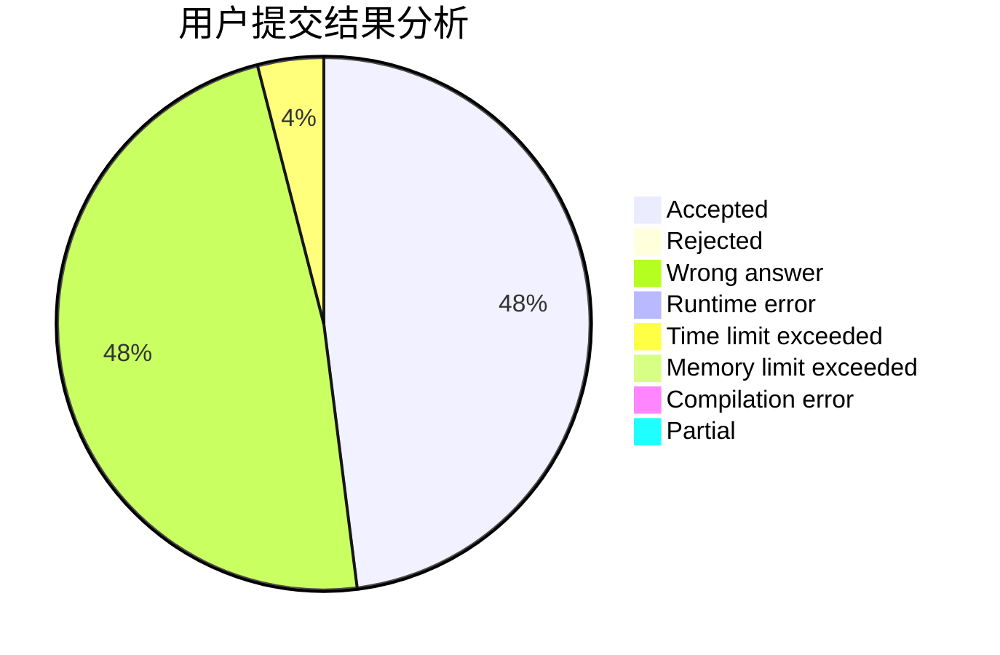
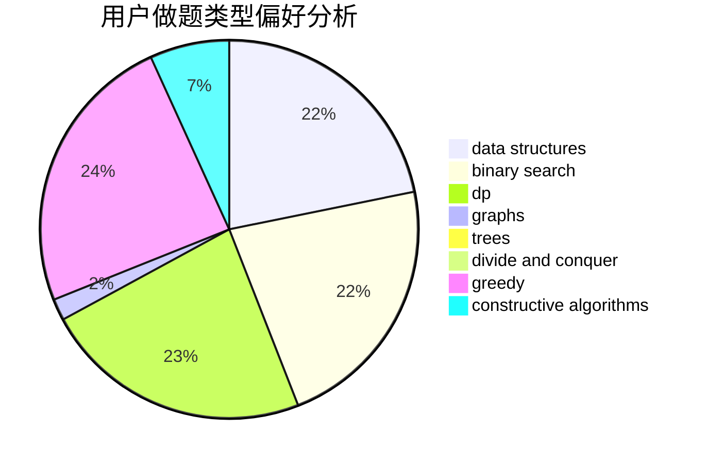
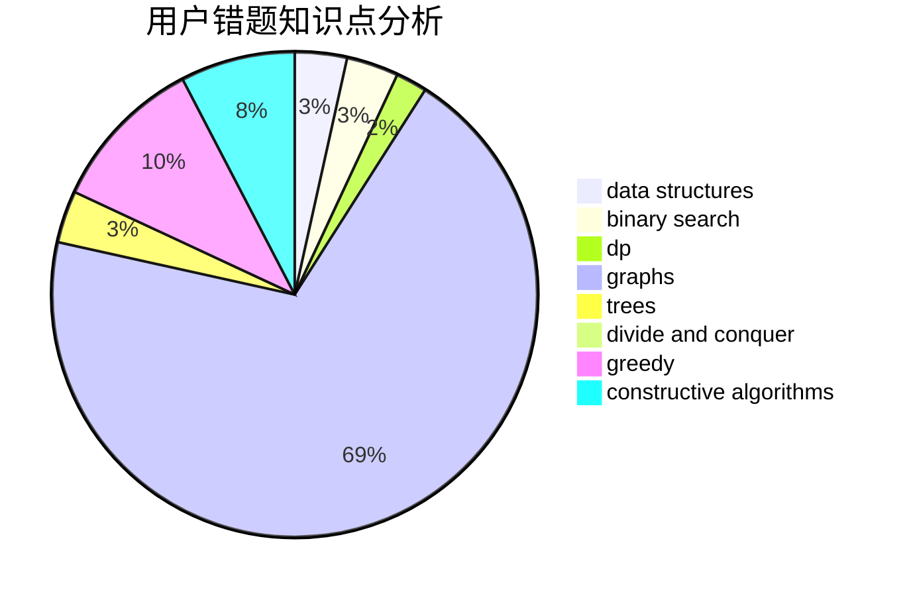

# TheBest

<!-- tabs:start -->

#### **用户提交结果分析**

#### **用户做题类型偏好分析**

#### **用户错题知识点分析**

<!-- tabs:end -->
# 推荐题目
[934E](https://codeforces.com/contest/934/problem/E)		dsu,graphs,sortings,trees		  
[1209E2](https://codeforces.com/contest/1209E/problem/2)		bitmasks,
                        dp,
                        greedy,
                        sortings		  
[193C](https://codeforces.com/contest/193/problem/C)		constructive algorithms,
                        greedy,
                        math,
                        matrices		  
[1330D](https://codeforces.com/contest/1330/problem/D)		dsu,graphs,sortings,trees		  
[468A](https://codeforces.com/contest/468/problem/A)		constructive algorithms,
                        greedy,
                        math		  
[802G](https://codeforces.com/contest/802/problem/G)		implementation,
                        strings		  
[1205F](https://codeforces.com/contest/1205/problem/F)		constructive algorithms,
                        math		  
[305C](https://codeforces.com/contest/305/problem/C)		greedy,
                        implementation		  
[816C](https://codeforces.com/contest/816/problem/C)		dsu,graphs,sortings,trees		  
[1280C](https://codeforces.com/contest/1280/problem/C)		dfs and similar,
                        graphs,
                        greedy,
                        trees		  
