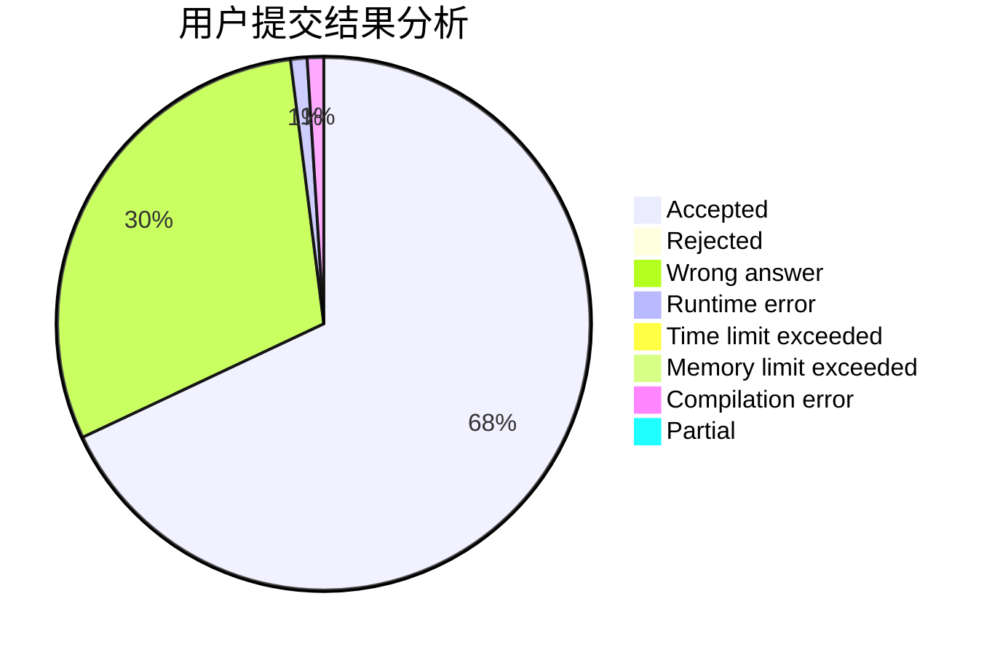
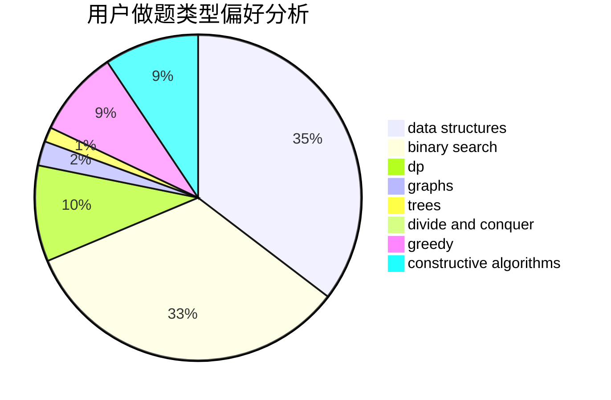
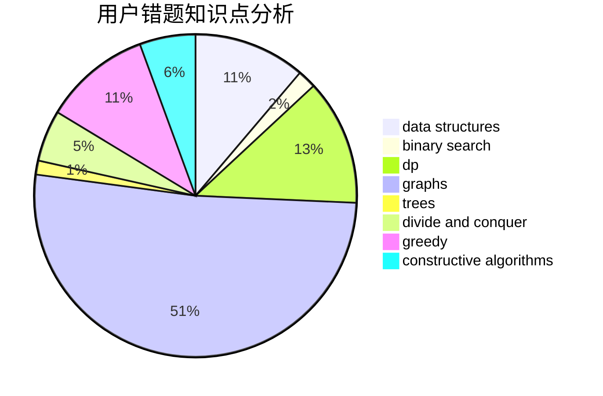

# TheBlueSnake

<!-- tabs:start -->

#### **用户提交结果分析**

#### **用户做题类型偏好分析**

#### **用户错题知识点分析**

<!-- tabs:end -->
# 推荐题目
[446C](https://codeforces.com/contest/446/problem/C)		data structures,
                        math,
                        number theory		  
[1002B4](https://codeforces.com/contest/1002B/problem/4)		nan		  
[1384E](https://codeforces.com/contest/1384/problem/E)		dsu,graphs,sortings,trees		  
[678A](https://codeforces.com/contest/678/problem/A)		implementation,
                        math		  
[835F](https://codeforces.com/contest/835/problem/F)		dfs and similar,
                        dp,
                        graphs,
                        trees		  
[38G](https://codeforces.com/contest/38/problem/G)		data structures		  
[370A](https://codeforces.com/contest/370/problem/A)		graphs,
                        math,
                        shortest paths		  
[1089M](https://codeforces.com/contest/1089/problem/M)		constructive algorithms,
                        graphs		  
[461E](https://codeforces.com/contest/461/problem/E)		binary search,
                        shortest paths,
                        strings		  
[864B](https://codeforces.com/contest/864/problem/B)		brute force,
                        implementation,
                        strings		  
