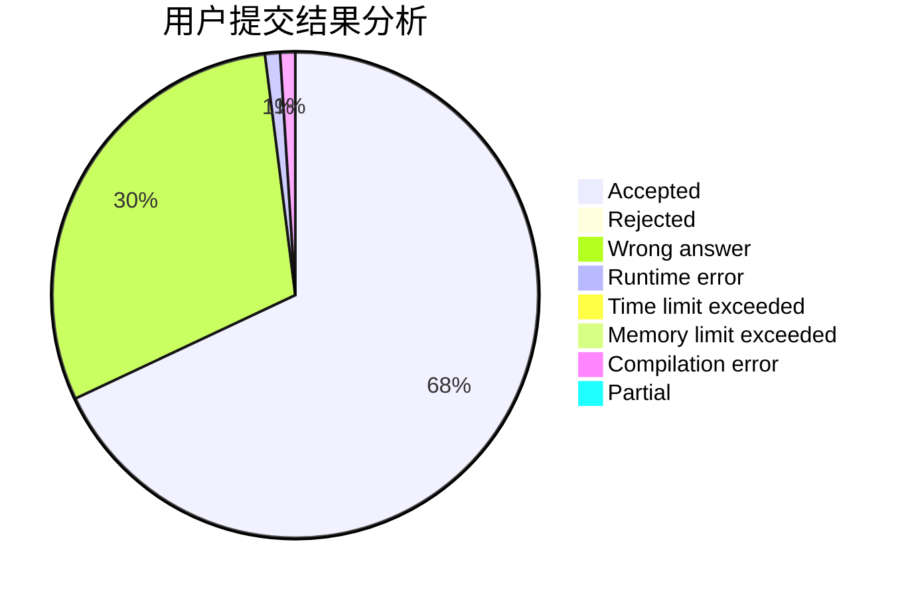
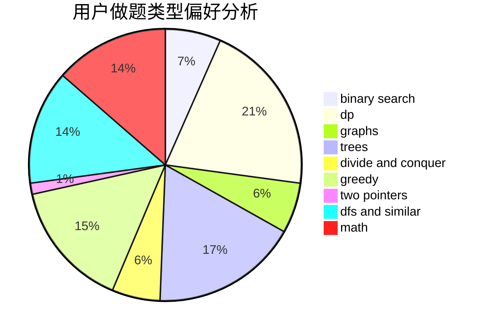

# TheBlueSnake

<!-- tabs:start -->

#### **用户提交结果分析**

#### **用户做题类型偏好分析**

<!-- tabs:end -->
# 推荐题目
[466D](https://codeforces.com/contest/466/problem/D)
[10023](https://codeforces.com/contest/1002/problem/3)
[1394E](https://codeforces.com/contest/1394/problem/E)
[701E](https://codeforces.com/contest/701/problem/E)
[853D](https://codeforces.com/contest/853/problem/D)
[41E](https://codeforces.com/contest/41/problem/E)
[3C](https://codeforces.com/contest/3/problem/C)
[1090B](https://codeforces.com/contest/1090/problem/B)
[480E](https://codeforces.com/contest/480/problem/E)
[883K](https://codeforces.com/contest/883/problem/K)
