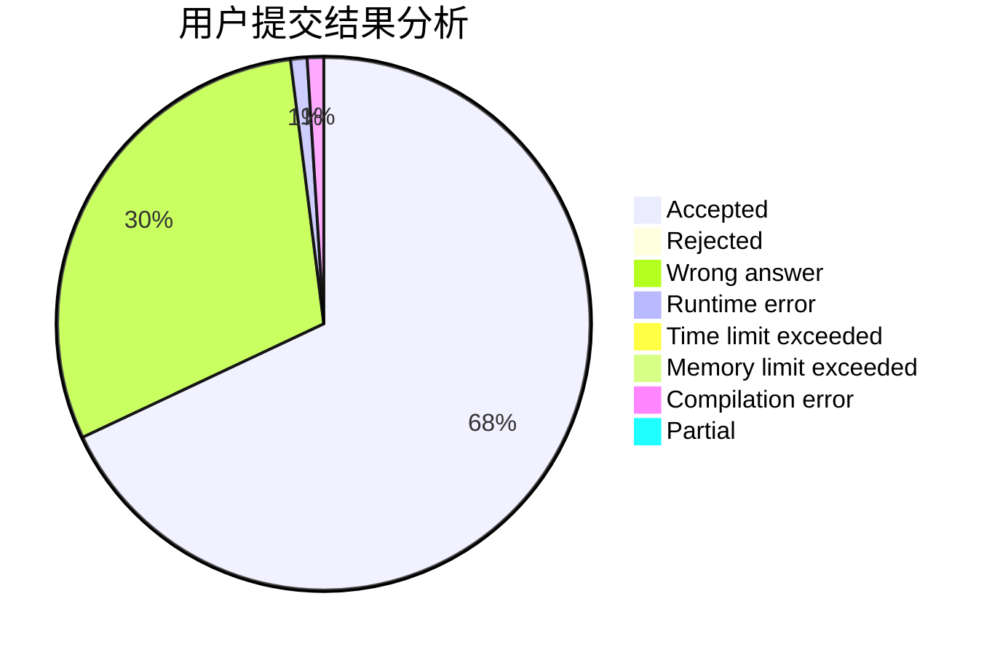
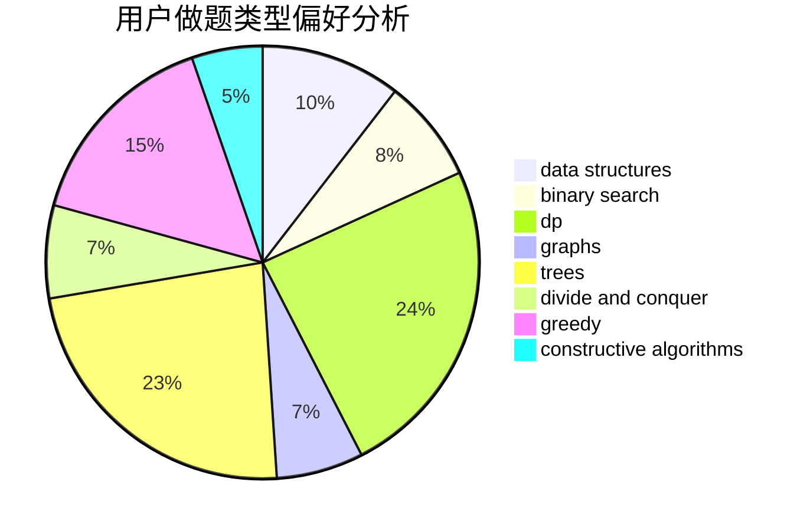
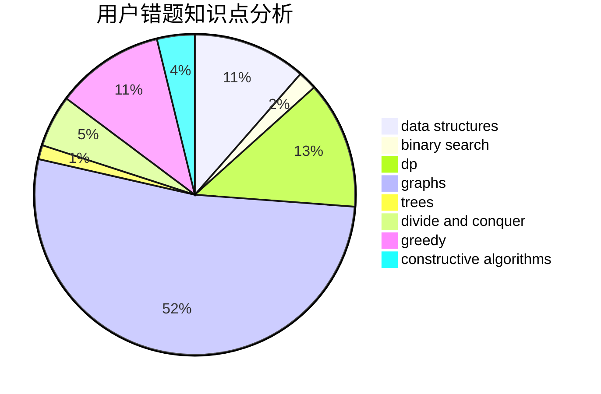

# TheBlueSnake

<!-- tabs:start -->

#### **用户提交结果分析**

#### **用户做题类型偏好分析**

#### **用户错题知识点分析**

<!-- tabs:end -->
# 推荐题目
[466D](https://codeforces.com/contest/466/problem/D)		combinatorics,
                        dp		  
[10023](https://codeforces.com/contest/1002/problem/3)		dsu,graphs,sortings,trees		  
[1394E](https://codeforces.com/contest/1394/problem/E)		strings		  
[701E](https://codeforces.com/contest/701/problem/E)		dsu,graphs,sortings,trees		  
[853D](https://codeforces.com/contest/853/problem/D)		binary search,
                        dp,
                        greedy		  
[41E](https://codeforces.com/contest/41/problem/E)		constructive algorithms,
                        graphs,
                        greedy		  
[3C](https://codeforces.com/contest/3/problem/C)		brute force,
                        games,
                        implementation		  
[1090B](https://codeforces.com/contest/1090/problem/B)		nan		  
[480E](https://codeforces.com/contest/480/problem/E)		data structures,
                        divide and conquer		  
[883K](https://codeforces.com/contest/883/problem/K)		constructive algorithms,
                        greedy,
                        implementation		  
