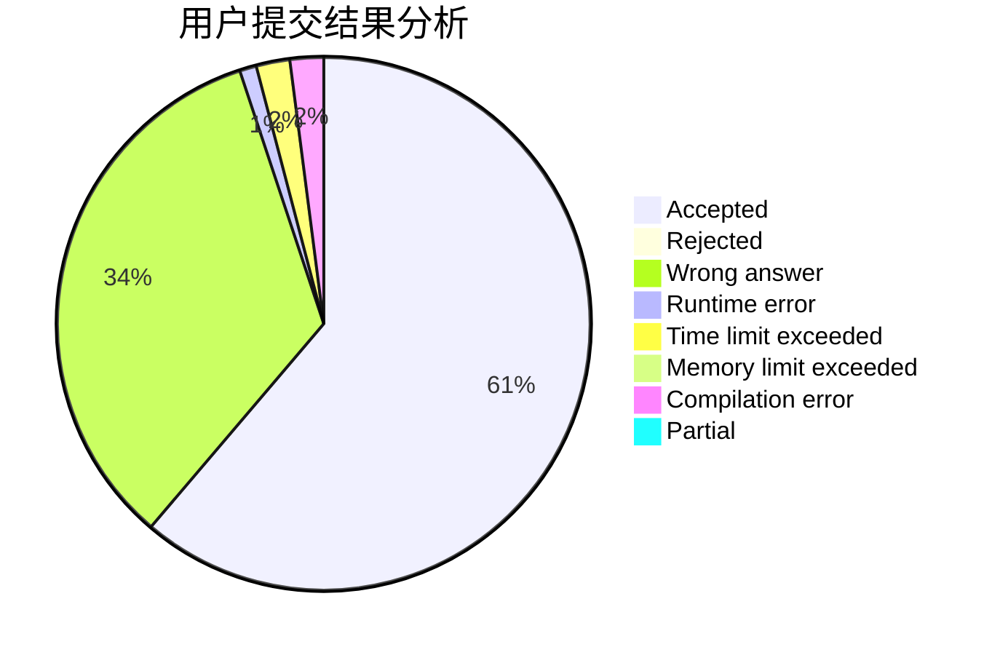
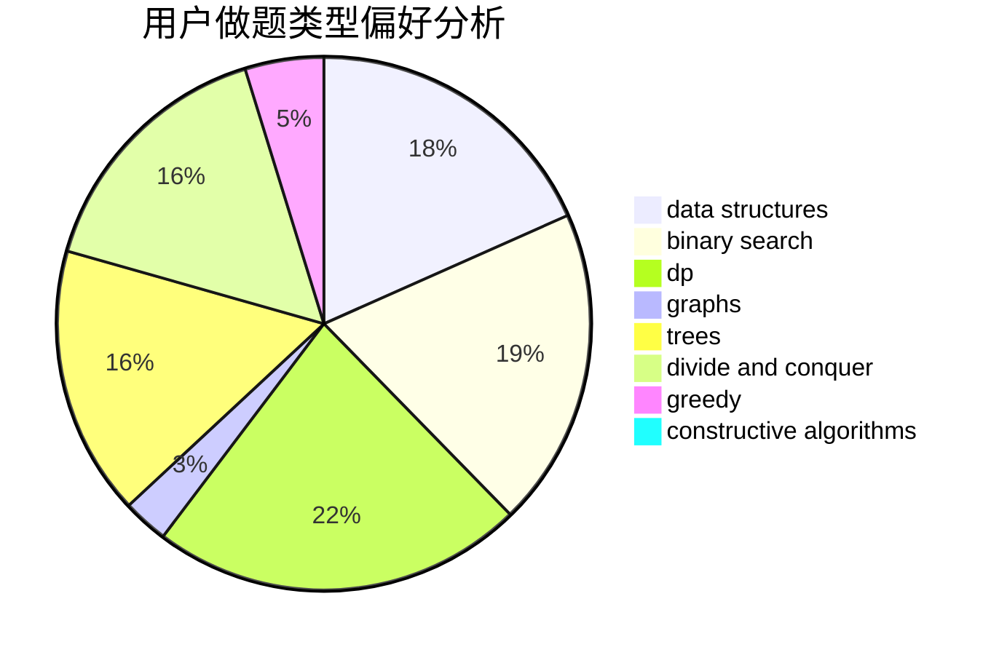
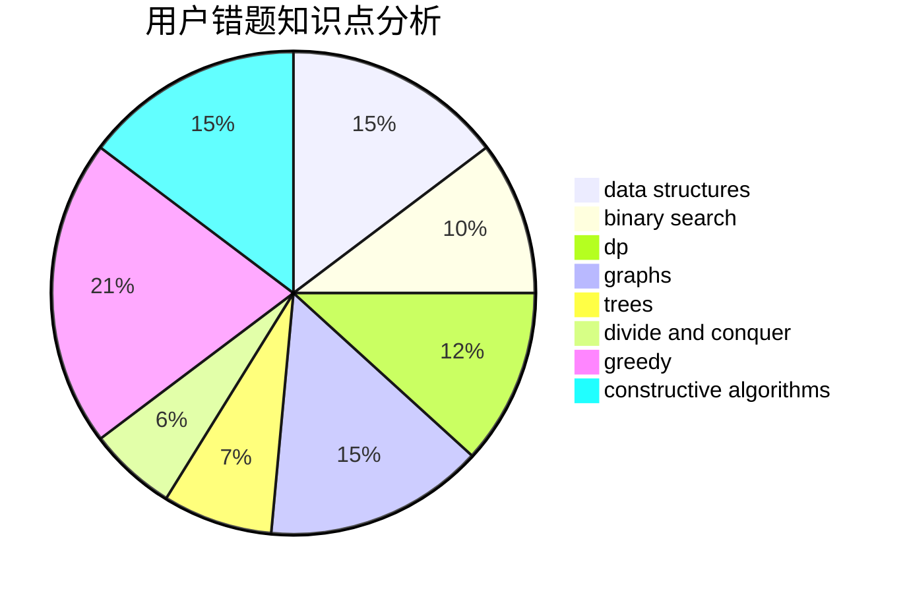

# Achtoria

<!-- tabs:start -->

#### **用户提交结果分析**

#### **用户做题类型偏好分析**

#### **用户错题知识点分析**

<!-- tabs:end -->
# 推荐题目
[190C](https://codeforces.com/contest/190/problem/C)		dfs and similar		  
[190E](https://codeforces.com/contest/190/problem/E)		data structures,
                        dsu,
                        graphs,
                        hashing,
                        sortings		  
[193C](https://codeforces.com/contest/193/problem/C)		constructive algorithms,
                        greedy,
                        math,
                        matrices		  
[18E](https://codeforces.com/contest/18/problem/E)		dp		  
[193B](https://codeforces.com/contest/193/problem/B)		brute force		  
[193A](https://codeforces.com/contest/193/problem/A)		constructive algorithms,
                        graphs,
                        trees		  
[1102F](https://codeforces.com/contest/1102/problem/F)		binary search,
                        bitmasks,
                        brute force,
                        dp,
                        graphs		  
[1006A](https://codeforces.com/contest/1006/problem/A)		implementation		  
[1041A](https://codeforces.com/contest/1041/problem/A)		greedy,
                        implementation,
                        sortings		  
[191C](https://codeforces.com/contest/191/problem/C)		data structures,
                        dfs and similar,
                        trees		  
