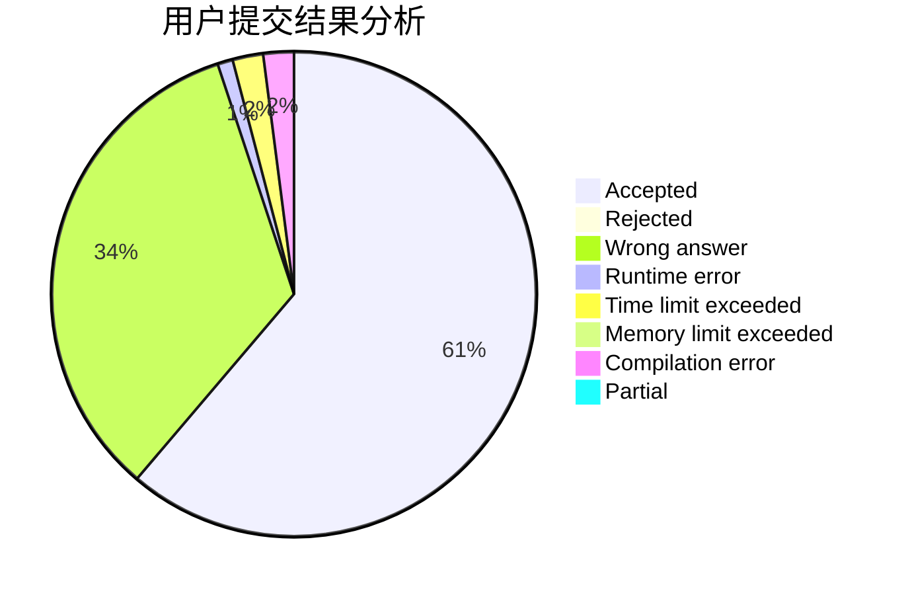
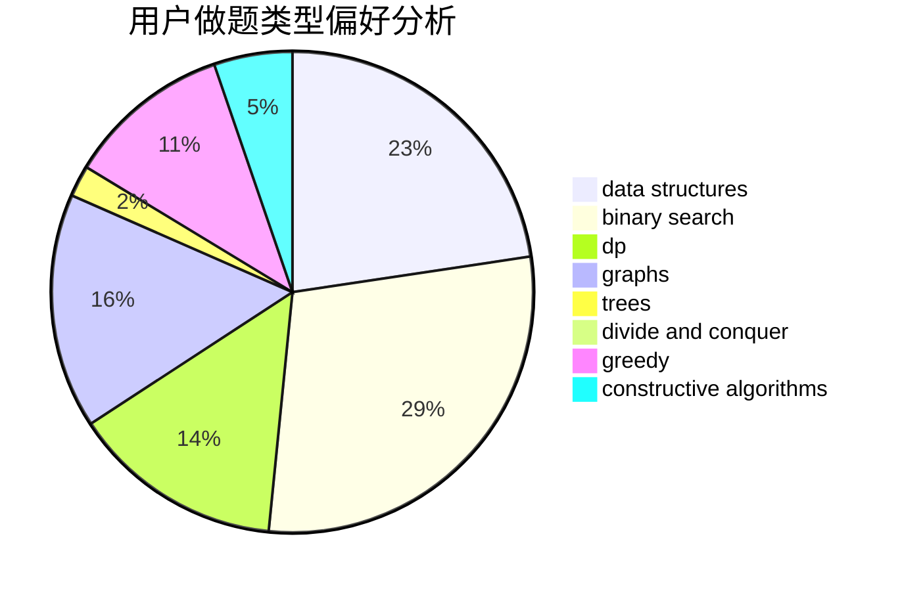
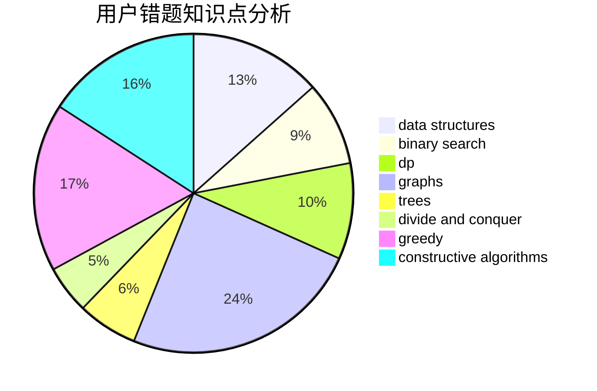

# Achtoria

<!-- tabs:start -->

#### **用户提交结果分析**

#### **用户做题类型偏好分析**

#### **用户错题知识点分析**

<!-- tabs:end -->
# 推荐题目
[165D](https://codeforces.com/contest/165/problem/D)		data structures,
                        dsu,
                        trees		  
[165E](https://codeforces.com/contest/165/problem/E)		bitmasks,
                        brute force,
                        dfs and similar,
                        dp		  
[167B](https://codeforces.com/contest/167/problem/B)		dp,
                        math,
                        probabilities		  
[165C](https://codeforces.com/contest/165/problem/C)		binary search,
                        brute force,
                        dp,
                        math,
                        strings,
                        two pointers		  
[166E](https://codeforces.com/contest/166/problem/E)		dp,
                        math,
                        matrices		  
[166C](https://codeforces.com/contest/166/problem/C)		greedy,
                        math,
                        sortings		  
[1102C](https://codeforces.com/contest/1102/problem/C)		games		  
[1005E1](https://codeforces.com/contest/1005E/problem/1)		sortings		  
[1040A](https://codeforces.com/contest/1040/problem/A)		greedy		  
[166A](https://codeforces.com/contest/166/problem/A)		binary search,
                        implementation,
                        sortings		  
