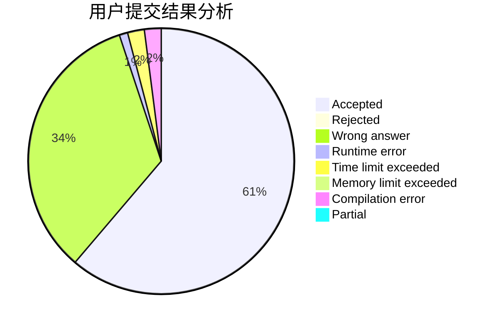
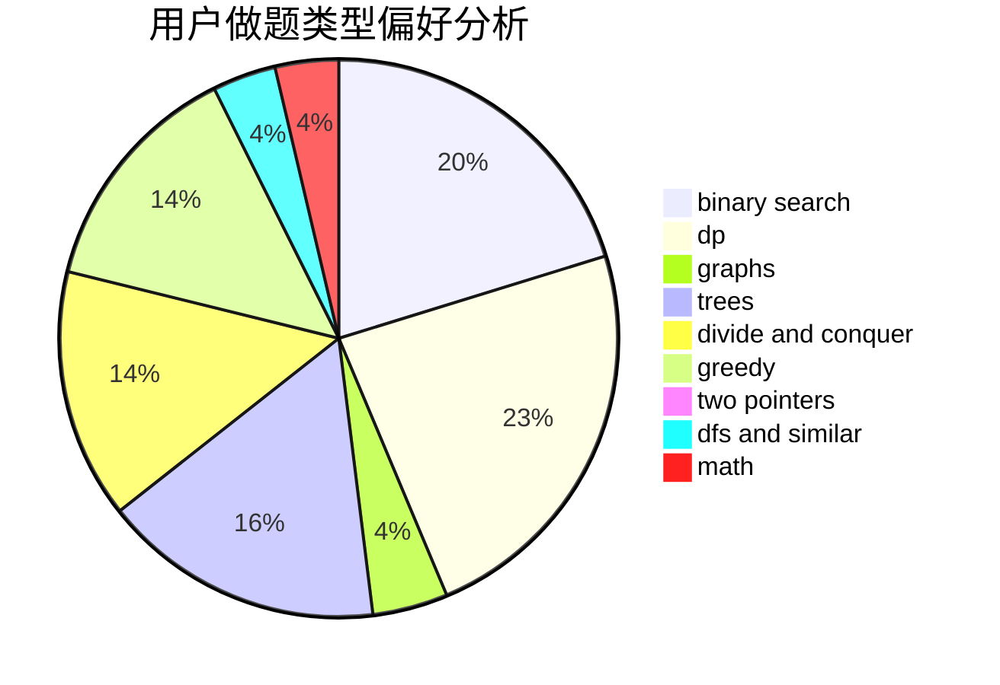

# Achtoria

<!-- tabs:start -->

#### **用户提交结果分析**

#### **用户做题类型偏好分析**

<!-- tabs:end -->
# 推荐题目
[190C](https://codeforces.com/contest/190/problem/C)
[190E](https://codeforces.com/contest/190/problem/E)
[193C](https://codeforces.com/contest/193/problem/C)
[18E](https://codeforces.com/contest/18/problem/E)
[193B](https://codeforces.com/contest/193/problem/B)
[193A](https://codeforces.com/contest/193/problem/A)
[1102F](https://codeforces.com/contest/1102/problem/F)
[1006A](https://codeforces.com/contest/1006/problem/A)
[1041A](https://codeforces.com/contest/1041/problem/A)
[191C](https://codeforces.com/contest/191/problem/C)
