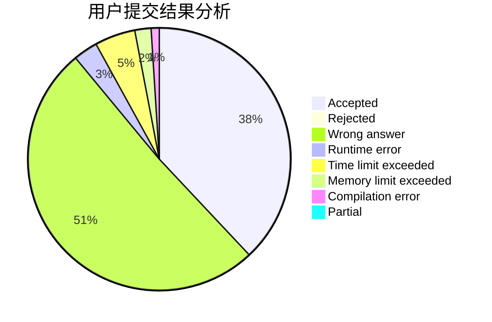
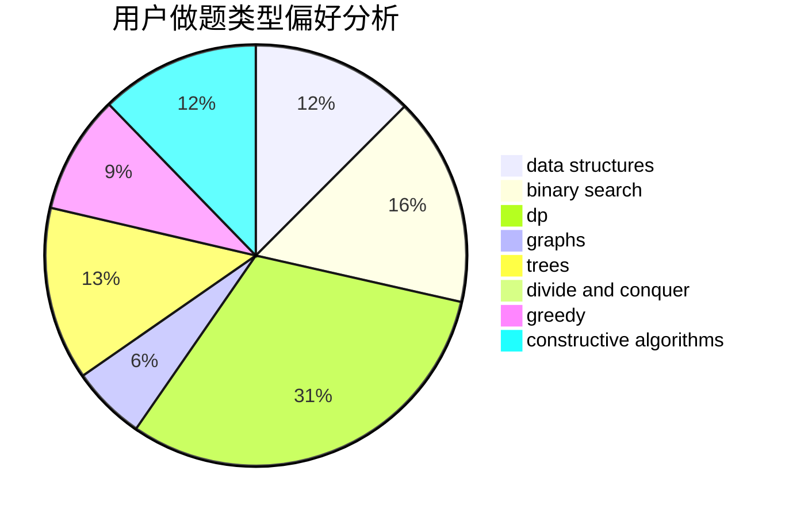

# TheLastHope

<!-- tabs:start -->

#### **用户提交结果分析**

#### **用户做题类型偏好分析**

#### **用户错题知识点分析**

<!-- tabs:end -->
# 推荐题目
[507D](https://codeforces.com/contest/507/problem/D)		dp,
                        implementation		  
[378B](https://codeforces.com/contest/378/problem/B)		implementation,
                        sortings		  
[1473C](https://codeforces.com/contest/1473/problem/C)		constructive algorithms,
                        math		  
[1246A](https://codeforces.com/contest/1246/problem/A)		dsu,graphs,sortings,trees		  
[190E](https://codeforces.com/contest/190/problem/E)		data structures,
                        dsu,
                        graphs,
                        hashing,
                        sortings		  
[1378A3](https://codeforces.com/contest/1378A/problem/3)		dsu,graphs,sortings,trees		  
[533E](https://codeforces.com/contest/533/problem/E)		constructive algorithms,
                        dp,
                        greedy,
                        hashing,
                        strings,
                        two pointers		  
[978A](https://codeforces.com/contest/978/problem/A)		implementation		  
[817A](https://codeforces.com/contest/817/problem/A)		implementation,
                        math,
                        number theory		  
[1437B](https://codeforces.com/contest/1437/problem/B)		constructive algorithms,
                        greedy		  
