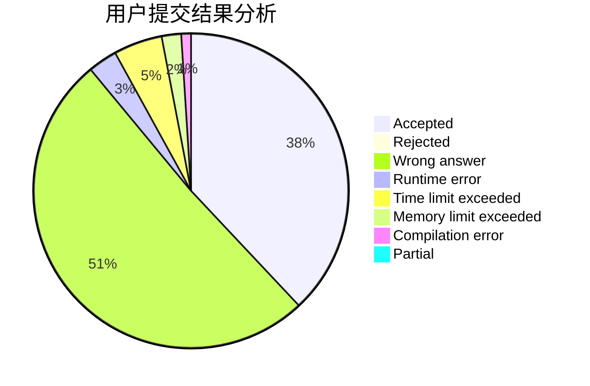
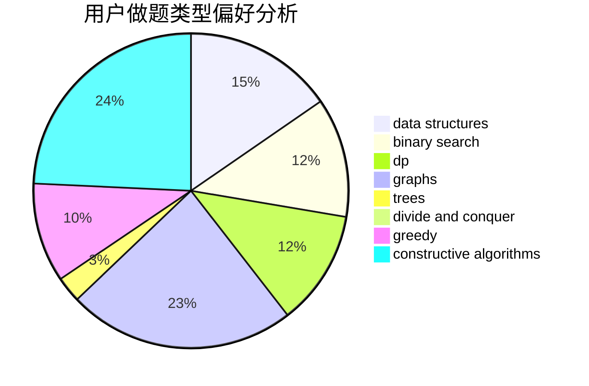

# TheLastHope

<!-- tabs:start -->

#### **用户提交结果分析**

#### **用户做题类型偏好分析**

#### **用户错题知识点分析**

<!-- tabs:end -->
# 推荐题目
[527D](https://codeforces.com/contest/527/problem/D)		data structures,
                        dp,
                        greedy,
                        implementation,
                        sortings		  
[407C](https://codeforces.com/contest/407/problem/C)		brute force,
                        combinatorics,
                        implementation,
                        math		  
[1481F](https://codeforces.com/contest/1481/problem/F)		dp,
                        greedy,
                        trees		  
[1250I](https://codeforces.com/contest/1250/problem/I)		binary search,
                        brute force,
                        greedy,
                        shortest paths		  
[215E](https://codeforces.com/contest/215/problem/E)		combinatorics,
                        dp,
                        number theory		  
[1387C](https://codeforces.com/contest/1387/problem/C)		*special problem,
                        dp,
                        shortest paths,
                        string suffix structures		  
[555C](https://codeforces.com/contest/555/problem/C)		data structures		  
[991E](https://codeforces.com/contest/991/problem/E)		brute force,
                        combinatorics,
                        math		  
[837A](https://codeforces.com/contest/837/problem/A)		implementation		  
[14471](https://codeforces.com/contest/1447/problem/1)		dsu,graphs,sortings,trees		  
