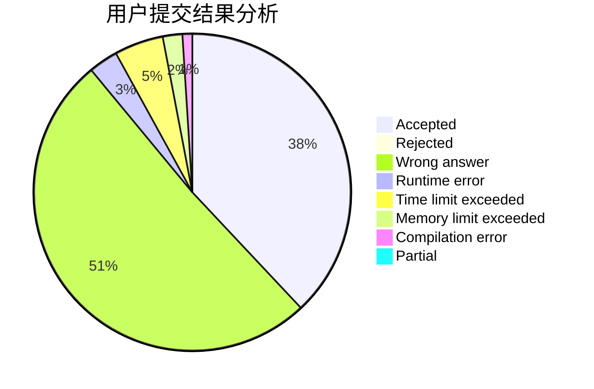
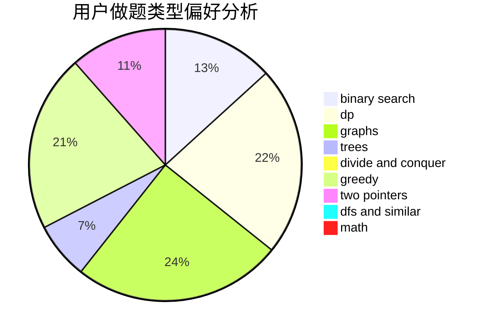

# TheLastHope

<!-- tabs:start -->

#### **用户提交结果分析**

#### **用户做题类型偏好分析**

<!-- tabs:end -->
# 推荐题目
[527D](https://codeforces.com/contest/527/problem/D)
[407C](https://codeforces.com/contest/407/problem/C)
[1481F](https://codeforces.com/contest/1481/problem/F)
[1250I](https://codeforces.com/contest/1250/problem/I)
[215E](https://codeforces.com/contest/215/problem/E)
[1387C](https://codeforces.com/contest/1387/problem/C)
[555C](https://codeforces.com/contest/555/problem/C)
[991E](https://codeforces.com/contest/991/problem/E)
[837A](https://codeforces.com/contest/837/problem/A)
[14471](https://codeforces.com/contest/1447/problem/1)
