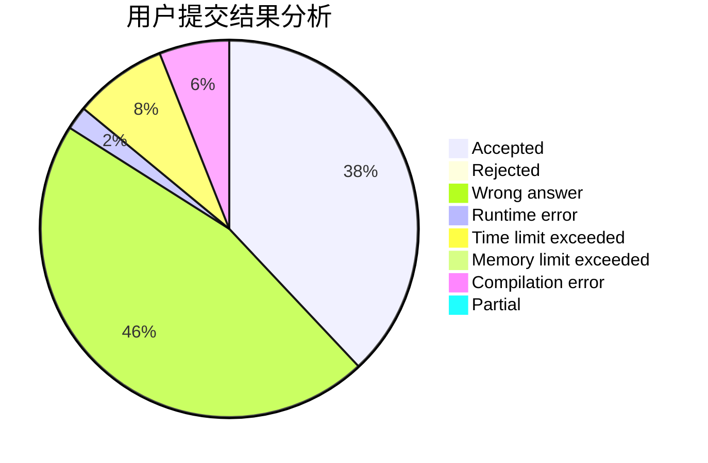
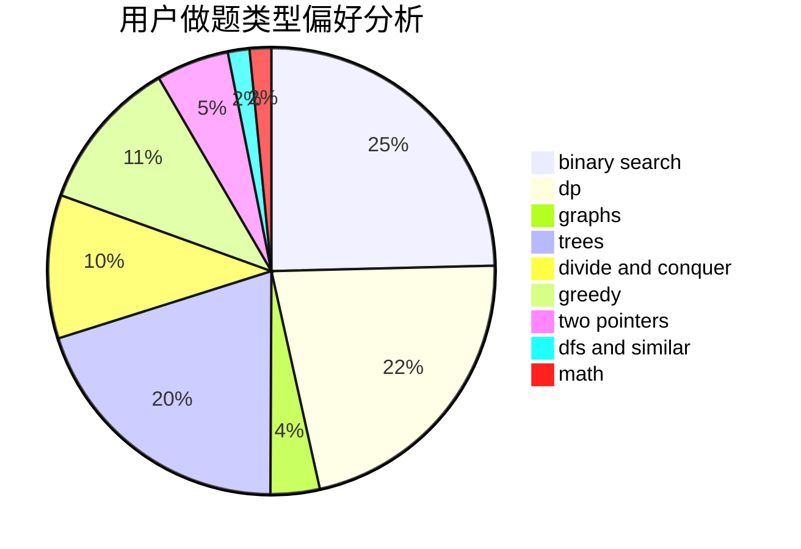

# TheLightOfDown1

<!-- tabs:start -->

#### **用户提交结果分析**

#### **用户做题类型偏好分析**

<!-- tabs:end -->
# 推荐题目
[1070H](https://codeforces.com/contest/1070/problem/H)
[519D](https://codeforces.com/contest/519/problem/D)
[704E](https://codeforces.com/contest/704/problem/E)
[1505G](https://codeforces.com/contest/1505/problem/G)
[11082](https://codeforces.com/contest/1108/problem/2)
[689B](https://codeforces.com/contest/689/problem/B)
[1011D](https://codeforces.com/contest/1011/problem/D)
[294C](https://codeforces.com/contest/294/problem/C)
[253A](https://codeforces.com/contest/253/problem/A)
[1411A](https://codeforces.com/contest/1411/problem/A)
