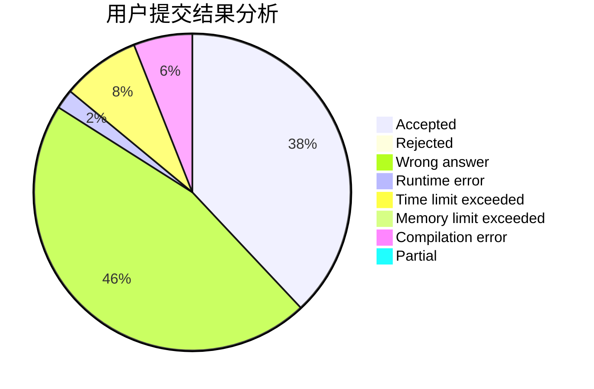
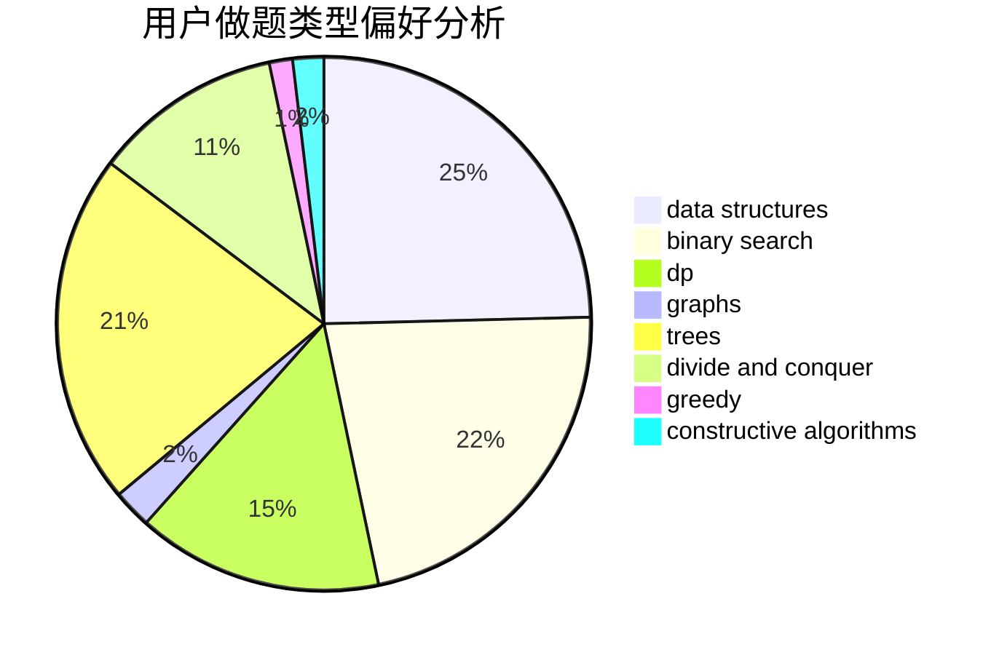
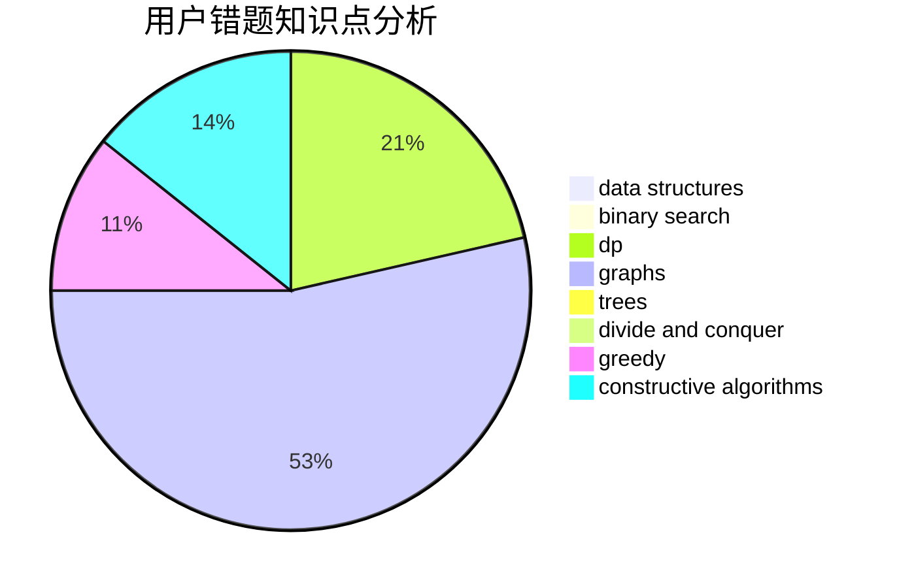

# TheLightOfDown1

<!-- tabs:start -->

#### **用户提交结果分析**

#### **用户做题类型偏好分析**

#### **用户错题知识点分析**

<!-- tabs:end -->
# 推荐题目
[1070H](https://codeforces.com/contest/1070/problem/H)		brute force,
                        implementation		  
[519D](https://codeforces.com/contest/519/problem/D)		data structures,
                        dp,
                        two pointers		  
[704E](https://codeforces.com/contest/704/problem/E)		data structures,
                        geometry,
                        trees		  
[1505G](https://codeforces.com/contest/1505/problem/G)		implementation		  
[11082](https://codeforces.com/contest/1108/problem/2)		dsu,graphs,sortings,trees		  
[689B](https://codeforces.com/contest/689/problem/B)		dfs and similar,
                        graphs,
                        greedy,
                        shortest paths		  
[1011D](https://codeforces.com/contest/1011/problem/D)		dsu,graphs,sortings,trees		  
[294C](https://codeforces.com/contest/294/problem/C)		combinatorics,
                        number theory		  
[253A](https://codeforces.com/contest/253/problem/A)		greedy		  
[1411A](https://codeforces.com/contest/1411/problem/A)		implementation		  
