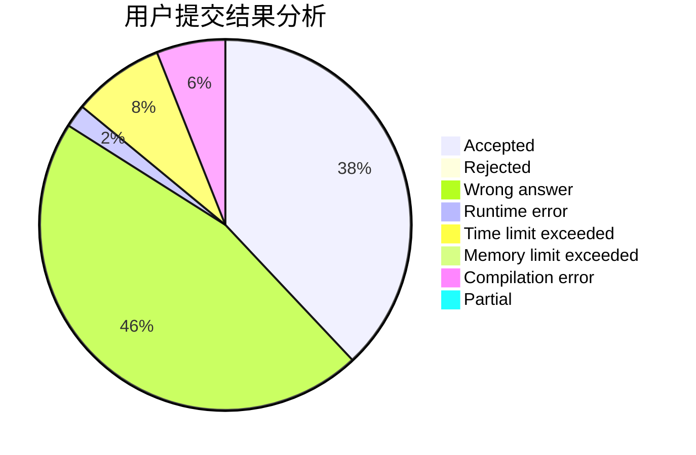
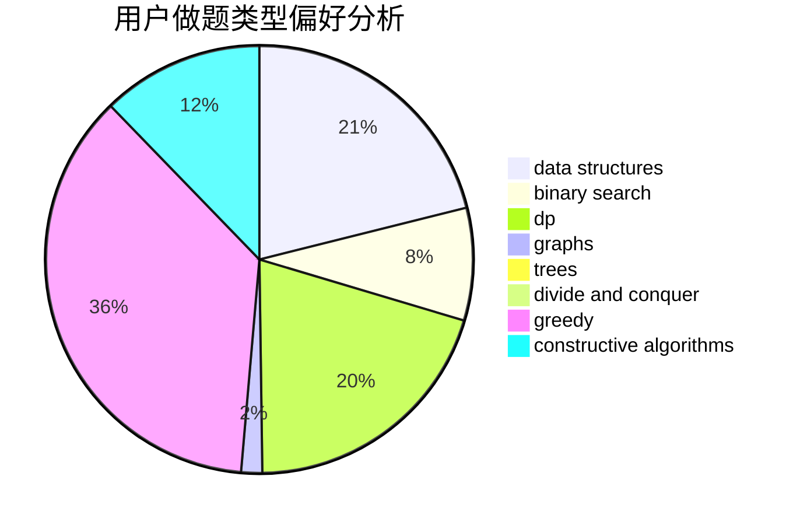
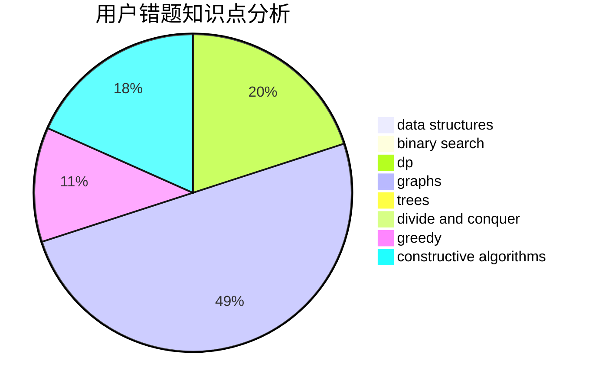

# TheLightOfDown1

<!-- tabs:start -->

#### **用户提交结果分析**

#### **用户做题类型偏好分析**

#### **用户错题知识点分析**

<!-- tabs:end -->
# 推荐题目
[1070E](https://codeforces.com/contest/1070/problem/E)		binary search,
                        data structures		  
[498D](https://codeforces.com/contest/498/problem/D)		data structures,
                        dp,
                        number theory		  
[681A](https://codeforces.com/contest/681/problem/A)		implementation		  
[1497A](https://codeforces.com/contest/1497/problem/A)		brute force,
                        data structures,
                        greedy,
                        sortings		  
[1107E](https://codeforces.com/contest/1107/problem/E)		dp		  
[667B](https://codeforces.com/contest/667/problem/B)		constructive algorithms,
                        geometry		  
[1011A](https://codeforces.com/contest/1011/problem/A)		greedy,
                        implementation,
                        sortings		  
[279D](https://codeforces.com/contest/279/problem/D)		bitmasks,
                        dp		  
[231C](https://codeforces.com/contest/231/problem/C)		binary search,
                        sortings,
                        two pointers		  
[1400F](https://codeforces.com/contest/1400/problem/F)		brute force,
                        dfs and similar,
                        dp,
                        string suffix structures,
                        strings		  
